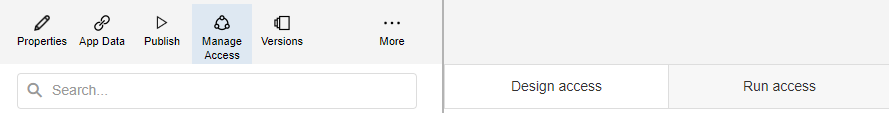

<!-- omit in toc -->
#  Unity - Tanks

[◄ Accelerators](https://github.com/XMPro/Blueprints-Accelerators-Patterns/tree/master/Accelerators)

[◄ Blueprints, Accelerators & Patterns](https://github.com/XMPro/Blueprints-Accelerators-Patterns)  
  
# Table of contents
1. [Files](#files)
2. [Description](#description)
3. [How To Import](#how-to-import)

# Files
<table>
<tr><td width="240px"> Type </td><td width="500px"> Name </td></tr>
<tr>
<td>Data Stream</td>
<td><a href="https://github.com/XMPro/Accelerators-Recipes-Blueprints/blob/master/Accelerators/3D%20Capability/Unity%20-%20Tanks/Data%20Stream/Simulate%20Tank%20Telemetry.xuc" target="_blank">Simulate Tank Telemetry</a></td>
</tr>
<tr>
<td>Application</td>
<td><a href="https://github.com/XMPro/Accelerators-Recipes-Blueprints/blob/master/Accelerators/3D%20Capability/Unity%20-%20Tanks/Application/Unity_Tanks.xapp" target="_blank">Unity Tanks</a></td>
</tr>
</table>

##
# Description
## Data Stream
An example of how to generate synthetic data and pass it through a data stream to a Unity model running within an application.

<details>
  <summary markdown="span">Expand to view screenshot</summary>


</details>

The data stream is configured using: 
* an <a href="https://xmpro.gitbook.io/event-simulator/" target="_blank"><i>Event Simulator</i></a> <a href="https://documentation.xmpro.com/concepts/agent#listeners" target="_blank">listener</a>
* a <a href="https://xmpro.gitbook.io/xmpro-app/" target="_blank"><i>XMPro App</i></a> <a href="https://documentation.xmpro.com/concepts/agent#action-agents" target="_blank">action agent</a>

##
## Application
An example of how to visualize the synthetic data passed by the data stream to a Unity model in an application.

<details>
  <summary markdown="span">Expand to view screenshot</summary>


</details>

The application page is configured using the following <a href="https://documentation.xmpro.com/concepts/application/block" target="_blank">blocks</a>:
* <a href="https://documentation.xmpro.com/blocks-toolbox/visualizations/unity-1" target="_blank"><i>Unity (Legacy)</i></a> to render the Unity files and pass the data to the scene
* <a href="https://documentation.xmpro.com/blocks-toolbox/basic/data-grid"><i>Grid</i></a> to allow the raw data to be viewed
* <a href="https://documentation.xmpro.com/blocks-toolbox/layout/box-and-data-repeater-box" target="_blank"><i>Box</i></a> to illustrate using a background image where the recommendations would appear 

##
# How to Import

Import Password: 
```
Dem0nstr@t1on
```
For instructions on how to import <a href="https://documentation.xmpro.com/how-tos/import-export-and-clone#importing">click here</a>.


Create/confirm the following variables
  * App Designer URL
  * App Designer Integration Key (Encrypted)

## 1. Import the data stream - <i><b>Simulate Tank Telemetry.xuc</b></i>

    * Select highest agent version number on import if prompted. 

    * Assign Access to others as required
	
	* Edit the XMPro agents and ensure the URL and Integration Key are selected  

	* Click Apply and save the data stream (Click Save on the Action Bar, or CTRL + S on the keyboard)
	* Publish the data stream and open the live view
	* Ensure there is data in the live view at the Post telemetry agents

<details>
  <summary markdown="span">Expand to view screenshot of a successfully running data stream with live data</summary>

   
</details>

## 2. Import the Application - <i><b>Unity_Tanks.xapp</b></i>

	* Map the data source on import:
  	* Landing Page: 
    	* Unity Data from Data Stream: Simulate Tank Telemetry | Send Tank Data to App 

<details>
  <summary markdown="span">Expand to view screenshot</summary>

 
</details>

    * Assign Access to others as required for design and runtime

<details>
  <summary markdown="span">Expand to view screenshot</summary>

 
</details>

	
	* Save the Application
	* Publish the application
	* Ensure there is data in the application and that the Unity model is receiving its  
      data by hovering over and observing the values


<details>
  <summary markdown="span">Expand to view screenshot</summary>

 

</details>

## Contributing
This repository was created by <a href="https://xmpro.com/">XMPro</a>. For assistance or requests, please contact <a href="mailto:support@xmpro.com">support@xmpro.com</a>

## License
[](https://choosealicense.com/licenses/mit/)