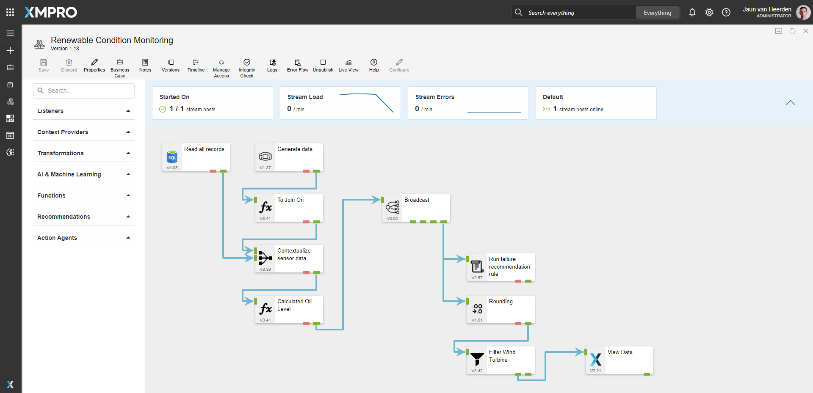
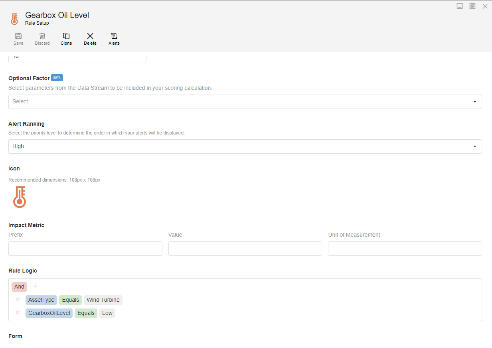
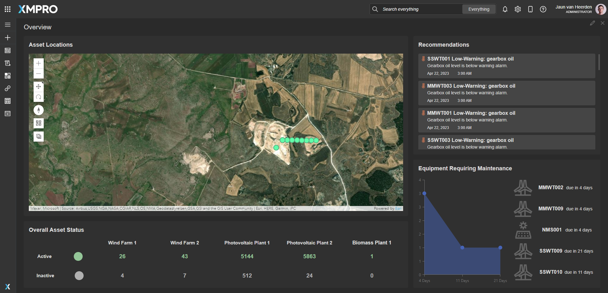
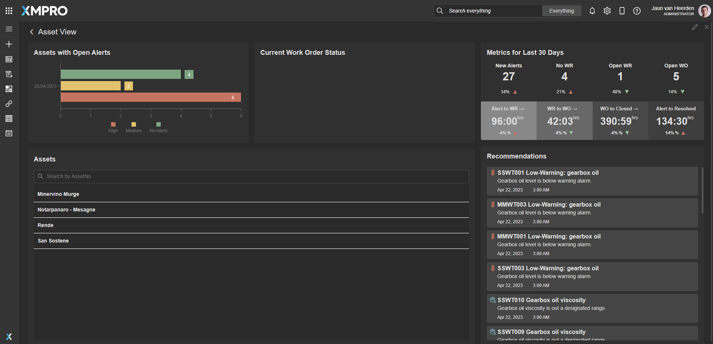
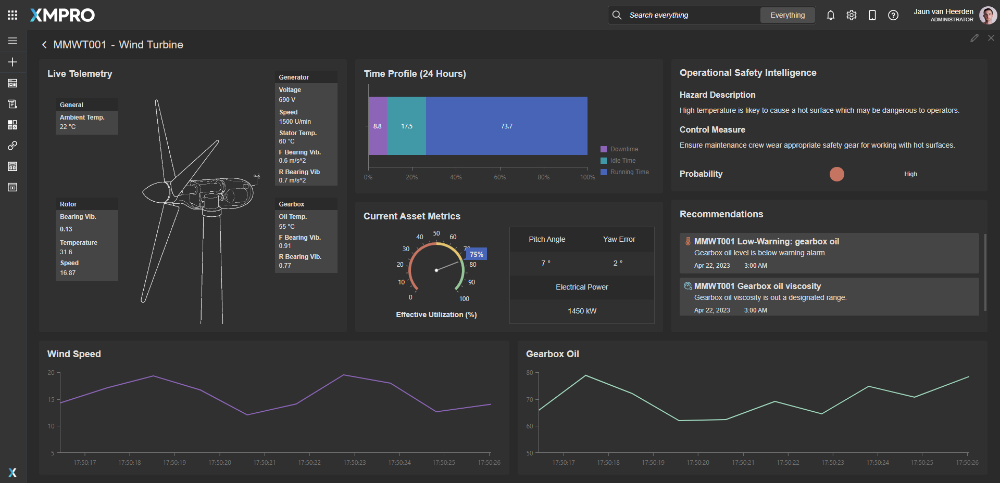
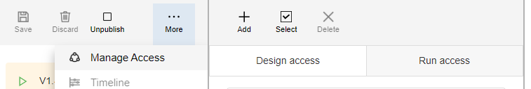
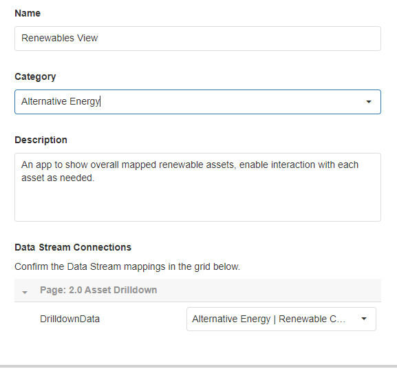

#  Alternative Energy - Renewable View 

[**◄ Accelerators**](https://github.com/XMPro/Blueprints-Accelerators-Patterns/tree/master/Accelerators)

[**◄ Blueprints, Accelerators & Patterns**](https://github.com/XMPro/Blueprints-Accelerators-Patterns)

# Table of contents
1. [Files](#files)
2. [Description](#description)
3. [How To Import](#how-to-import)


# Files

* SQL Scripts: <a href="https://github.com/XMPro/Blueprints-Accelerators-Patterns/blob/master/Accelerators/Alternative%20Energy%20-%20Renewable%20View/SQL%20Scripts/%5BDemoAlternativeEnergyAsset%5D.sql" target="_blank">[DemoAlternativeEnergyAsset]</a>, <a href="https://github.com/XMPro/Blueprints-Accelerators-Patterns/blob/master/Accelerators/Alternative%20Energy%20-%20Renewable%20View/SQL%20Scripts/%5BDemoWorkManagementWindTurbine%5D.sql" target="_blank">[DemoWorkManagementWindTurbine]</a>
* Data Stream: <a href="https://github.com/XMPro/Blueprints-Accelerators-Patterns/blob/master/Accelerators/Alternative%20Energy%20-%20Renewable%20View/Data%20Stream/Renewable%20Condition%20Monitoring.xuc" target="_blank">Renewable Condition Monitoring</a>
* Recommendation: <a href="https://github.com/XMPro/Blueprints-Accelerators-Patterns/blob/master/Accelerators/Alternative%20Energy%20-%20Renewable%20View/Recommendation/Gearbox%20Oil.xr" target="_blank">Gearbox Oil</a>
* Application: <a href="https://github.com/XMPro/Blueprints-Accelerators-Patterns/blob/master/Accelerators/Alternative%20Energy%20-%20Renewable%20View/Application/Renewables%20View.xapp" target="_blank">Renewables View</a>


# Description


## SQL Scripts


### DemoAlternativeEnergyAsset

A list of assets, their location and other details.

<details>
<summary>Columns</summary>

```
[ID]
,[AssetNo]
,[AssetType]
,[Latitude]
,[Longitude]
,[Active]
,[Criticality]
,[RiskScore]
,[Location]
,[AlertColor]
```
</details>


### DemoWorkManagementWindTurbine

Work management information.

<details>
<summary>Columns</summary>

```
[ID]
,[AssetNo]
,[WRNo]
,[WONo]
,[Title]
,[WOStatus]
,[Date]
```
</details>


<!-- blank line -->
----
<!-- blank line -->


## Data Stream

An example of how to contextualize simulated data, calculate an oil level, run recommendations and output the wind turbine data to the Application Designer.

The data stream is configured using: 

* <a href="https://xmpro.gitbook.io/event-simulator/" target="_blank"><i>Event Simulator</i></a> <a href="https://documentation.xmpro.com/concepts/agent#listeners" target="_blank">listener</a> - Simulates data for the stream
* <a href="https://xmpro.gitbook.io/calculated-field/" target="_blank"><i>Calculated Field</i></a> <a href="https://documentation.xmpro.com/concepts/agent#transformations" target="_blank">transformation</a> - Adding a boolean column for the join
* <a href="https://xmpro.gitbook.io/azure-sql/" target="_blank"><i>SQL</i></a> <a href="https://documentation.xmpro.com/concepts/agent#listeners" target="_blank">listener</a> - read all records from SQL
* <a href="https://xmpro.gitbook.io/join/" target="_blank"><i>Join</i></a> <a href="https://documentation.xmpro.com/concepts/agent#transformations" target="_blank">transformation</a> - Contextualize sensor data with data from SQL
* <a href="https://xmpro.gitbook.io/calculated-field/" target="_blank"><i>Calculated Field</i></a> <a href="https://documentation.xmpro.com/concepts/agent#transformations" target="_blank">transformation</a> - Calculate oil level as `"Low"` or `"High"`
* <a href="https://xmpro.gitbook.io/broadcast/" target="_blank"><i>Broadcast</i></a> - Broadcast data to other agents
* <a href="https://xmpro.gitbook.io/run-recommendation/" target="_blank"><i>Run Recommendation</i></a> <a href="https://documentation.xmpro.com/concepts/agent#recommendations" target="_blank">agent</a> - Run failure Recommendation Rule
* <a href="https://xmpro.gitbook.io/rounding/" target="_blank"><i>Rounding</i></a> <a href="https://documentation.xmpro.com/concepts/agent#transformations" target="_blank">transformation</a> - Rounding all values
* <a href="https://xmpro.gitbook.io/filter/" target="_blank"><i>Filter</i></a> <a href="https://documentation.xmpro.com/concepts/agent#transformations" target="_blank">transformation</a> - Filter for all wind turbine assets
* <a href="https://xmpro.gitbook.io/xmpro-app/" target="_blank"><i>XMPro App</i></a> <a href="https://documentation.xmpro.com/concepts/agent#action-agents" target="_blank">action agent</a> - View data in the App Designer

<details>
  <summary markdown="span">Expand to view screenshot</summary>


</details>

<!-- blank line -->
----
<!-- blank line -->


## Recommendation

The recommendation is configured using two rules: 

**Gearbox Oil Level**
+ Checks if the Wind Turbine assets have a low gearbox oil level.

<details>
<summary markdown="span">Expand to view screenshot</summary>


</details>

**Gearbox Oil Viscosity**
+ Checks if the Wind Turbine assets have a high gearbox oil viscosity.


<details>
<summary markdown="span">Expand to view screenshot</summary>


</details>

<!-- blank line -->
----
<!-- blank line -->

## Application
An example of how to vizualize the synthetic data passed by the data stream to a Unity model in an application.


### Landing Page
The application page is configured using the following <a href="https://documentation.xmpro.com/concepts/application/block" target="_blank">blocks</a>:

* <a href="https://documentation.xmpro.com/blocks-toolbox/visualizations/esri-map" target="_blank"><i>Esri Map</i></a> to render the 3D globe and visualize the assets at their geographic coordinates
* <a href="https://documentation.xmpro.com/blocks-toolbox/visualizations/chart"><i>Chart</i></a> to visualize the historical count of equiment requiring maintenance
* <a href="https://documentation.xmpro.com/blocks-toolbox/recommendations/recommendations" target="_blank"><i>Recommendations</i></a> to view current open recommendations for all assets
* <a href="https://documentation.xmpro.com/blocks-toolbox/basic/indicator" target="_blank"><i>Indicator</i></a> to visually inspect the active state of the assets

<details>
	<summary markdown="span">Expand to view screenshot</summary>


</details>

### Asset View
The application page is configured using the following <a href="https://documentation.xmpro.com/concepts/application/block" target="_blank">blocks</a>:

* <a href="https://documentation.xmpro.com/blocks-toolbox/visualizations/chart" target="_blank"><i>Chart</i></a> a horizontal bar graph to display assets with open alerts
* <a href="https://documentation.xmpro.com/blocks-toolbox/visualizations/pie-chart" target="_blank"><i>Pie Chart</i></a> to display the current work order status for the asset
* <a href="https://documentation.xmpro.com/blocks-toolbox/basic/indicator" target="_blank"><i>Indicator</i></a> to visualize the status of each asset
* <a href="https://documentation.xmpro.com/blocks-toolbox/layout/accordion"><i>Accordion</i></a> to allow the raw data to be viewed
* <a href="https://documentation.xmpro.com/blocks-toolbox/recommendations/recommendations" target="_blank"><i>Recommendations</i></a> to view current open recommendations for all assets

<details>
<summary markdown="span">Expand to view screenshot</summary>


</details>


### Asset Drilldown
The application page is configured using the following <a href="https://documentation.xmpro.com/concepts/application/block" target="_blank">blocks</a>:

* <a href="https://documentation.xmpro.com/blocks-toolbox/visualizations/circular-gauge"><i>Circular Gauge</i></a> showing the effective utilization percentage
* <a href="https://documentation.xmpro.com/blocks-toolbox/basic/indicator" target="_blank"><i>Indicator</i></a> presenting the status of hazard risk
* <a href="https://documentation.xmpro.com/blocks-toolbox/recommendations/recommendations" target="_blank"><i>Recommendations</i></a> to view current open recommendations for current asset
* <a href="https://documentation.xmpro.com/blocks-toolbox/visualizations/chart" target="_blank"><i>Charts</i></a> 
  * to show window of data for Wind Speed
  * to show window of data for Gearbox Oil
  * to display the time profile for the last 24 hours

<details>
<summary markdown="span">Expand to view screenshot</summary>


</details>


# How to Import
Import Password: `Dem0nstr@t1on`

Create/confirm the following variables
  * App Designer URL
  * App Designer Integration Key (Encrypted)
  * SQL Server
  * SQL Username
  * SQL Password (Encrypted)

For instructions on how to import <a href="https://documentation.xmpro.com/how-tos/import-export-and-clone#importing">click here</a>


## 1. Run SQL Scripts

	* Execute the scripts in SQL Server
	* Ensure the data is succesfully loaded into the database


## 2. Import the Data Stream

    * Assign Access to others as required
	
	* Edit the XMPro agent "View Data" and ensure the URL and Integration Key are selected
	* Edit the Recommendation agent "Run Failure Recommendation Rule" and ensure the URL and Integration Key are selected
	* Edit the Azure SQL agent "Read all Records" and ensure the Server Instance, Username and Password fields are filled in correctly

	* Click Apply and save the data stream (Click Save on the Action Bar, or CTRL + S on the keyboard)
	* Publish the data stream and open the live view
	* Ensure there is data in the live view at the Post telemetry agents

<details>
  <summary markdown="span">Expand to view screenshot of a successfully running data stream with live data</summary>

 
</details>


## 3. Import the Recommendation

    * Import the including form if it doesn't already exist

<details>
  <summary markdown="span">Expand to view screenshot</summary>

 

</details>

    * Assign Access to others as required

<details>
  <summary markdown="span">Expand to view screenshot</summary>

 

</details>

## 4. Import the Application

	* When importing the application make sure to map the data source on the import wizard to the above data stream that was imported
	* Confirm the connections are configured correctly in the App Data tab and in each Page Data tab

<details>
  <summary markdown="span">Expand to view screenshot</summary>

 
</details>

    * Assign Access to others as required for design and runtime

<details>
  <summary markdown="span">Expand to view screenshot</summary>

 
</details>

	* Edit the Application
    	* Select all recommendation elements on all pages and tick "Oil" in Block Properties > Behavior:
        	* Landing Page (top-right)
        	* Asset View (bottom-right)
        	* Asset Drilldown (center-left)

	* Save the Application
	* Publish the application
	* Ensure there is data in the applciation by checking each graph, status and gauge.

<!-- <details>
  <summary markdown="span">Expand to view screenshot</summary>

 
</details> -->

## Contributing
This repository was created by <a href="https://xmpro.com/">XMPro</a>. For assistance or requests, please contact <a href="mailto:support@xmpro.com">support@xmpro.com</a>

## License
[](https://choosealicense.com/licenses/mit/)