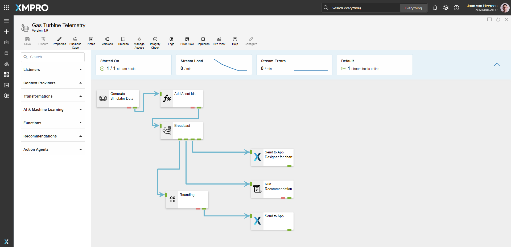
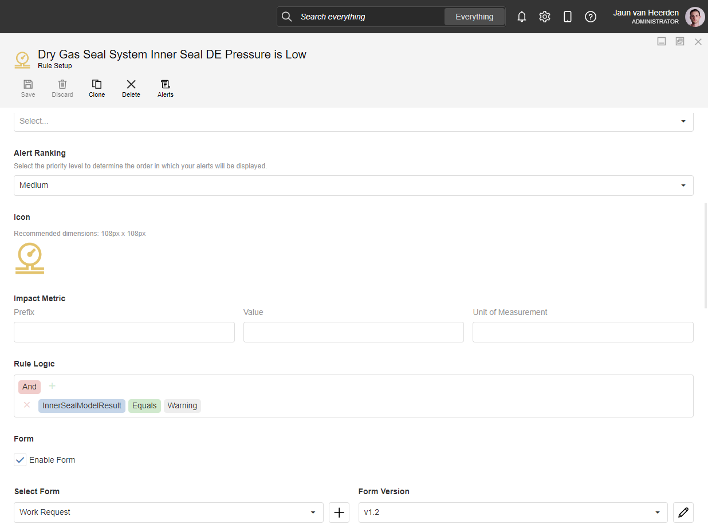
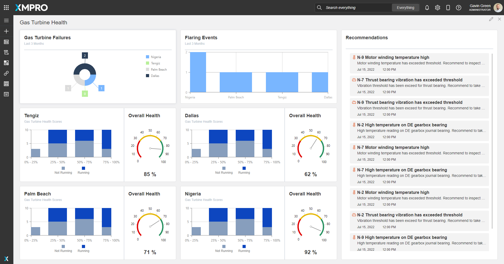
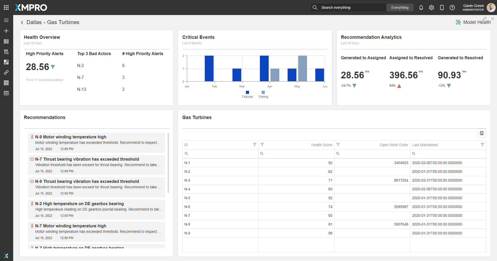
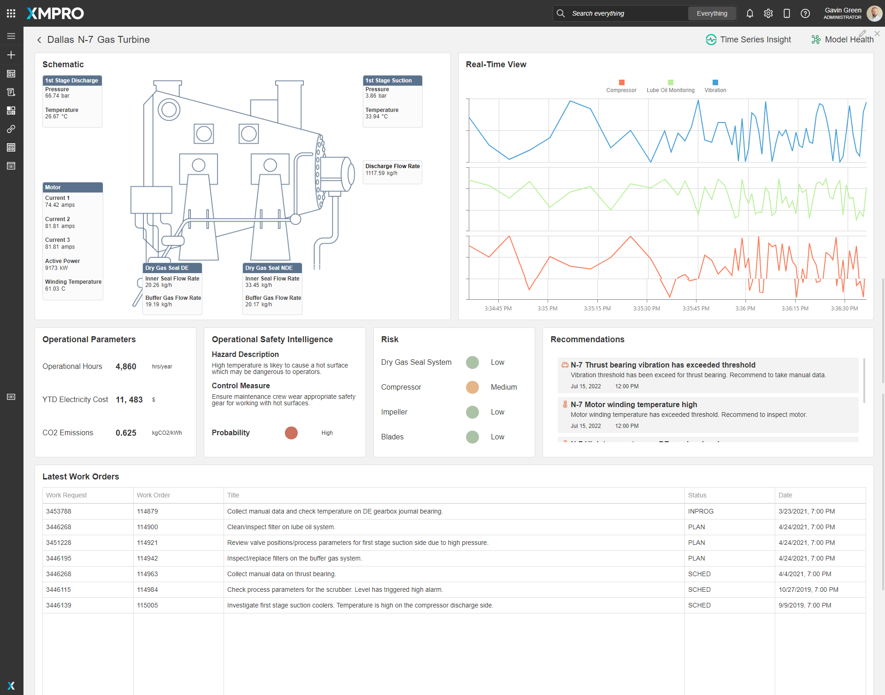
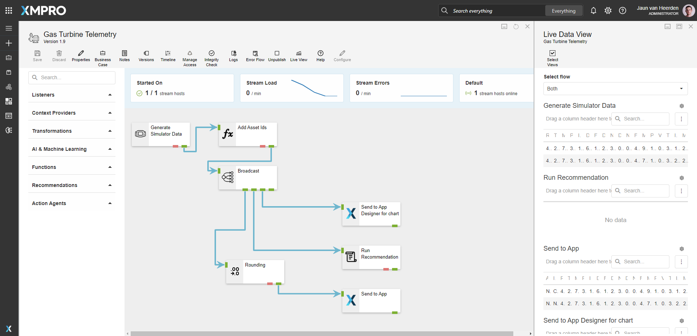
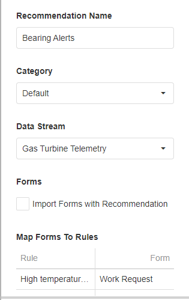
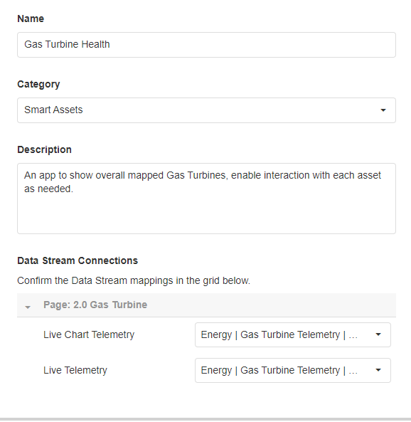

<!-- omit in toc -->
#  Energy - Gas Turbine Health 

[◄ Accelerators](https://github.com/XMPro/Blueprints-Accelerators-Patterns/tree/master/Accelerators)

[◄ Blueprints, Accelerators & Patterns](https://github.com/XMPro/Blueprints-Accelerators-Patterns)

# Table of contents
1. [Files](#files)
2. [Description](#description)
3. [How To Import](#how-to-import)

# Files
<table>
<tr><td width="240px"> Type </td><td width="500px"> Name </td></tr>
<tr>
<td>SQL Scripts</td>
<td><a href="https://github.com/XMPro/Blueprints-Accelerators-Patterns/blob/master/Accelerators/Energy%20-%20Gas%20Turbine%20Health/SQL%20Scripts/DemoGasTurbine.sql" target="_blank">DemoGasTurbine</a><br /><a href="https://github.com/XMPro/Blueprints-Accelerators-Patterns/blob/master/Accelerators/Energy%20-%20Gas%20Turbine%20Health/SQL%20Scripts/DemoWorkManagementCompressor.sql" target="_blank">DemoWorkManagementCompressor</a></td>
</tr>
<tr>
<td>Data Stream</td>
<td><a href="https://github.com/XMPro/Blueprints-Accelerators-Patterns/blob/master/Accelerators/Energy%20-%20Gas%20Turbine%20Health/Data%20Stream/Gas%20Turbine%20Telemetry.xuc" target="_blank">Gas Turbine Telemetry</a></td>
</tr>
<tr>
<td>Recommendation</td>
<td><a href="https://github.com/XMPro/Blueprints-Accelerators-Patterns/blob/master/Accelerators/Energy%20-%20Gas%20Turbine%20Health/Recommendation/Bearing%20Alerts.xr" target="_blank">Bearing Alerts</a><br /><a href="https://github.com/XMPro/Blueprints-Accelerators-Patterns/blob/master/Accelerators/Energy%20-%20Gas%20Turbine%20Health/Recommendation/Dry%20Gas%20Seal%20System.xr" target="_blank">Dry Gas Seal System</a><br /><a href="https://github.com/XMPro/Blueprints-Accelerators-Patterns/blob/master/Accelerators/Energy%20-%20Gas%20Turbine%20Health/Recommendation/Motor%20Winding%20Temperature.xr" target="_blank">Motor Winding Temperature</a></td>
</tr>
<tr>
<td>Application</td>
<td><a href="https://github.com/XMPro/Blueprints-Accelerators-Patterns/blob/master/Accelerators/Energy%20-%20Gas%20Turbine%20Health/Application/Gas%20Turbine%20Health.xapp" target="_blank">Gas Turbine Health</a></td>
</tr>
<tr>
<td>Template</td>
<td><a href="https://github.com/XMPro/Blueprints-Accelerators-Patterns/blob/master/Accelerators/Energy%20-%20Gas%20Turbine%20Health/Template/Gas%20Turbine%20Health.xtml" target="_blank">Gas Turbine Health</a></td>
</tr>
</table>

# Description
## SQL Scripts

<details>
<summary>DemoGasTurbine (A list of assets, their location and other details)</summary>

```SQL
/****** Object:  Table [dbo].[DemoGasTurbine]    Script Date: 25/07/2022 9:32:04 AM ******/
SET ANSI_NULLS ON
GO
SET QUOTED_IDENTIFIER ON
GO
CREATE TABLE [dbo].[DemoGasTurbine](
	[ID] [bigint] IDENTITY(1,1) NOT NULL,
	[AssetId] [nvarchar](25) NOT NULL,
	[HealthScore] [float] NULL,
	[OpenWO] [numeric](18, 0) NULL,
	[LastMaintained] [datetime] NULL,
 CONSTRAINT [PK_DemoGasTurbine] PRIMARY KEY CLUSTERED 
(
	[ID] ASC
)WITH (STATISTICS_NORECOMPUTE = OFF, IGNORE_DUP_KEY = OFF, OPTIMIZE_FOR_SEQUENTIAL_KEY = OFF) ON [PRIMARY]
) ON [PRIMARY]
GO
SET IDENTITY_INSERT [dbo].[DemoGasTurbine] ON 

INSERT [dbo].[DemoGasTurbine] ([ID], [AssetId], [HealthScore], [OpenWO], [LastMaintained]) VALUES (5, N'N-2', 62, NULL, CAST(N'2020-01-31T00:00:00.000' AS DateTime))
INSERT [dbo].[DemoGasTurbine] ([ID], [AssetId], [HealthScore], [OpenWO], [LastMaintained]) VALUES (6, N'N-3', 71, CAST(8017204 AS Numeric(18, 0)), CAST(N'2020-03-31T00:00:00.000' AS DateTime))
INSERT [dbo].[DemoGasTurbine] ([ID], [AssetId], [HealthScore], [OpenWO], [LastMaintained]) VALUES (7, N'N-4', 85, NULL, CAST(N'2020-02-06T00:00:00.000' AS DateTime))
INSERT [dbo].[DemoGasTurbine] ([ID], [AssetId], [HealthScore], [OpenWO], [LastMaintained]) VALUES (8, N'N-1', 92, CAST(3404653 AS Numeric(18, 0)), CAST(N'2020-02-06T00:00:00.000' AS DateTime))
INSERT [dbo].[DemoGasTurbine] ([ID], [AssetId], [HealthScore], [OpenWO], [LastMaintained]) VALUES (9, N'N-5', 92, NULL, CAST(N'2020-01-31T00:00:00.000' AS DateTime))
INSERT [dbo].[DemoGasTurbine] ([ID], [AssetId], [HealthScore], [OpenWO], [LastMaintained]) VALUES (10, N'N-6', 74, CAST(5589987 AS Numeric(18, 0)), CAST(N'2020-01-31T00:00:00.000' AS DateTime))
INSERT [dbo].[DemoGasTurbine] ([ID], [AssetId], [HealthScore], [OpenWO], [LastMaintained]) VALUES (11, N'N-7', 65, NULL, CAST(N'2020-01-31T00:00:00.000' AS DateTime))
INSERT [dbo].[DemoGasTurbine] ([ID], [AssetId], [HealthScore], [OpenWO], [LastMaintained]) VALUES (12, N'N-8', 81, CAST(5907648 AS Numeric(18, 0)), CAST(N'2020-01-31T00:00:00.000' AS DateTime))
INSERT [dbo].[DemoGasTurbine] ([ID], [AssetId], [HealthScore], [OpenWO], [LastMaintained]) VALUES (13, N'N-9', 98, NULL, CAST(N'2020-01-31T00:00:00.000' AS DateTime))
SET IDENTITY_INSERT [dbo].[DemoGasTurbine] OFF
GO

```

</details>

<details>
<summary>DemoWorkManagementCompressor (Work management information)</summary>

```SQL
SET ANSI_NULLS ON
GO
SET QUOTED_IDENTIFIER ON
GO
CREATE TABLE [dbo].[DemoWorkManagementCompressor](
	[ID] [bigint] IDENTITY(1,1) NOT NULL,
	[AssetNo] [nvarchar](50) NULL,
	[WRNo] [nvarchar](50) NULL,
	[WONo] [nvarchar](50) NULL,
	[Title] [nvarchar](250) NULL,
	[WOStatus] [nvarchar](50) NULL,
	[Date] [datetime] NULL,
 CONSTRAINT [PK_DemoWorkManagementCompressor] PRIMARY KEY CLUSTERED 
(
	[ID] ASC
)WITH (STATISTICS_NORECOMPUTE = OFF, IGNORE_DUP_KEY = OFF, OPTIMIZE_FOR_SEQUENTIAL_KEY = OFF) ON [PRIMARY]
) ON [PRIMARY]
GO
SET IDENTITY_INSERT [dbo].[DemoWorkManagementCompressor] ON 
GO
INSERT [dbo].[DemoWorkManagementCompressor] ([ID], [AssetNo], [WRNo], [WONo], [Title], [WOStatus], [Date]) VALUES (1, N'MMWT004', N'3453788', N'114879', N'Collect manual data and check temperature on DE gearbox journal bearing.', N'INPROG', CAST(N'2021-03-24T00:00:00.000' AS DateTime))
GO
INSERT [dbo].[DemoWorkManagementCompressor] ([ID], [AssetNo], [WRNo], [WONo], [Title], [WOStatus], [Date]) VALUES (2, N'MMWT004', N'3446268', N'114900', N'Clean/inspect filter on lube oil system.', N'PLAN', CAST(N'2021-04-25T00:00:00.000' AS DateTime))
GO
INSERT [dbo].[DemoWorkManagementCompressor] ([ID], [AssetNo], [WRNo], [WONo], [Title], [WOStatus], [Date]) VALUES (3, N'MMWT004', N'3451228', N'114921', N'Review valve positions/process parameters for first stage suction side due to high pressure.', N'PLAN', CAST(N'2021-04-25T00:00:00.000' AS DateTime))
GO
INSERT [dbo].[DemoWorkManagementCompressor] ([ID], [AssetNo], [WRNo], [WONo], [Title], [WOStatus], [Date]) VALUES (4, N'MMWT004', N'3446195', N'114942', N'Inspect/replace filters on the buffer gas system.', N'PLAN', CAST(N'2021-04-25T00:00:00.000' AS DateTime))
GO
INSERT [dbo].[DemoWorkManagementCompressor] ([ID], [AssetNo], [WRNo], [WONo], [Title], [WOStatus], [Date]) VALUES (5, N'MMWT004', N'3446268', N'114963', N'Collect manual data on thrust bearing.', N'SCHED', CAST(N'2021-04-05T00:00:00.000' AS DateTime))
GO
INSERT [dbo].[DemoWorkManagementCompressor] ([ID], [AssetNo], [WRNo], [WONo], [Title], [WOStatus], [Date]) VALUES (6, N'MMWT004', N'3446115', N'114984', N'Check process parameters for the scrubber. Level has triggered high alarm.', N'SCHED', CAST(N'2019-10-28T00:00:00.000' AS DateTime))
GO
INSERT [dbo].[DemoWorkManagementCompressor] ([ID], [AssetNo], [WRNo], [WONo], [Title], [WOStatus], [Date]) VALUES (7, N'MMWT004', N'3446139', N'115005', N'Investigate first stage suction coolers. Temperature is high on the compressor discharge side.', N'SCHED', CAST(N'2019-09-10T00:00:00.000' AS DateTime))
GO
SET IDENTITY_INSERT [dbo].[DemoWorkManagementCompressor] OFF
GO

```

</details>

## Data Stream

An example of how to contextualize simulated data, broadcast the data, run recommendations and output the gas turbine data to the Application Designer.

<details>
  <summary markdown="span">Expand to view screenshot</summary>


</details>

The data stream is configured using: 

* an <a href="https://xmpro.gitbook.io/event-simulator/" target="_blank"><i>Event Simulator</i></a> <a href="https://documentation.xmpro.com/concepts/agent#listeners" target="_blank">listener</a> - Simulates data for the stream
* a <a href="https://xmpro.gitbook.io/calculated-field/" target="_blank"><i>Calculated Field</i></a> <a href="https://documentation.xmpro.com/concepts/agent#transformations" target="_blank">transformation</a> - Adding asset Ids
* a <a href="https://xmpro.gitbook.io/broadcast/" target="_blank"><i>Broadcast</i></a> - Broadcast data to other agents
* a <a href="https://xmpro.gitbook.io/run-recommendation/" target="_blank"><i>Run Recommendation</i></a> <a href="https://documentation.xmpro.com/concepts/agent#recommendations" target="_blank">agent</a> - Run failure Recommendation Rule
* a <a href="https://xmpro.gitbook.io/rounding/" target="_blank"><i>Rounding</i></a> <a href="https://documentation.xmpro.com/concepts/agent#transformations" target="_blank">transformation</a> - Rounding all values
* two <a href="https://xmpro.gitbook.io/xmpro-app/" target="_blank"><i>XMPro App</i></a> <a href="https://documentation.xmpro.com/concepts/agent#action-agents" target="_blank">action agents</a>:
  * The first *Send to App Designer for Chart* is configured with a cache of 20 for the historic data.
  * The second *Send to App* is configured with a cache of 1 for live status.

## Recommendation

The recommendation is configured using three rules: 

<details>
<summary markdown="span">Bearing Alerts - High temperature, thrust bearing vibration</summary>


</details>

<details>
<summary markdown="span">Dry Gas Seal System - Low pressure on dry gas seal system inner seal of the gearbox drive-end</summary>


</details>

<details>
<summary markdown="span">Motor Winding - Temperature being exceeded</summary>


</details>

##
## Application
An overview of sites that drilldown to individual assets providing real-time data and status of the gas turbines.


### Landing Page
<details>
	<summary markdown="span">Expand to view screenshot</summary>


</details>

The application page is configured using the following <a href="https://documentation.xmpro.com/concepts/application/block" target="_blank">blocks</a>:

* <a href="https://documentation.xmpro.com/blocks-toolbox/visualizations/pie-chart" target="_blank"><i>Pie Chart</i></a> to display the failure counts for all sites
* <a href="https://documentation.xmpro.com/blocks-toolbox/visualizations/chart" target="_blank"><i>Charts</i></a> 
  * a bar graph to display flaring events
  * a bar graph to display health scores in a histogram
* <a href="https://documentation.xmpro.com/blocks-toolbox/visualizations/circular-gauge"><i>Circular Gauge</i></a> showing the overall health of the site

##
### Site View
<details>
<summary markdown="span">Expand to view screenshot</summary>


</details>

The application page is configured using the following <a href="https://documentation.xmpro.com/concepts/application/block" target="_blank">blocks</a>:

* <a href="https://documentation.xmpro.com/blocks-toolbox/basic/indicator" target="_blank"><i>Indicator</i></a> presenting the status of health rate
* <a href="https://documentation.xmpro.com/blocks-toolbox/visualizations/chart" target="_blank"><i>Chart</i></a> a bar graph to display flaring events
* <a href="https://documentation.xmpro.com/blocks-toolbox/basic/data-grid" target="_blank"><i>Data Grid</i></a> presenting the data for each asset
* <a href="https://documentation.xmpro.com/blocks-toolbox/recommendations/recommendations" target="_blank"><i>Recommendations</i></a> to view current open recommendations for all assets

##
### Gas Turbine
<details>
<summary markdown="span">Expand to view screenshot</summary>


</details>

The application page is configured using the following <a href="https://documentation.xmpro.com/concepts/application/block" target="_blank">blocks</a>:

* <a href="https://documentation.xmpro.com/blocks-toolbox/basic/text" target="_blank"><i>Text</i></a> to display the live data
* <a href="https://documentation.xmpro.com/blocks-toolbox/visualizations/chart" target="_blank"><i>Chart</i></a> to display a window of live data
* <a href="https://documentation.xmpro.com/blocks-toolbox/basic/indicator" target="_blank"><i>Indicators</i></a> 
  * presenting the status of hazard risk
  * presenting the status of component risk
* <a href="https://documentation.xmpro.com/blocks-toolbox/recommendations/recommendations" target="_blank"><i>Recommendations</i></a> to view current open recommendations for all assets
* <a href="https://documentation.xmpro.com/blocks-toolbox/basic/data-grid" target="_blank"><i>Data Grid</i></a> displaying the latest work orders

##
### Model View
<details>
<summary markdown="span">Expand to view screenshot</summary>


</details>

The application page is configured using the following <a href="https://documentation.xmpro.com/concepts/application/block" target="_blank">blocks</a>:

* <a href="https://documentation.xmpro.com/blocks-toolbox/visualizations/d3-visualization" target="_blank"><i>D3 Visualization</i></a> to display an anomaly detection graph

##
# How to Import

Import Password: 
```
Dem0nstr@t1on
```
For instructions on how to import <a href="https://documentation.xmpro.com/how-tos/import-export-and-clone#importing">click here</a>.

Create/confirm the following variables
  * App Designer URL
  * App Designer Integration Key (Encrypted)
  * SQL Server
  * SQL Username
  * SQL Password (Encrypted)

## 1. Run SQL Scripts

	* Execute the scripts in SQL Server
	* Ensure the data is successfully loaded into the database

## 2. Import the Data Stream

    * Select highest agent version number on import if prompted. 

    * Assign Access to others as required
	
	* Edit the XMPro agents and ensure the URL and Integration Key are selected  
	* Edit the Recommendation agent and ensure the URL and Integration Key are selected

	* Click Apply and save the data stream (Click Save on the Action Bar, or CTRL + S on the keyboard)
	* Publish the data stream and open the live view
	* Ensure there is data in the live view at the XMPro App agents

<details>
  <summary markdown="span">Expand to view screenshot of a successfully running data stream with live data</summary>

 
</details>


## 3. Import the Recommendations

    * Import the included form if it doesn't already exist

<details>
  <summary markdown="span">Expand to view screenshot</summary>

 

</details>

    * Assign Access to others as required

<details>
  <summary markdown="span">Expand to view screenshot</summary>

 

</details>

## 4. Import the Application

    * Map the data source on import:
      	* Gas Turbine:
        	* Live Chart Telemetry: Gas Turbine Telemetry | Send to App Designer for chart
        	* Live Telemetry: Gas Turbine Telemetry | Send to App
  	* Confirm the connections are configured correctly in the App Data tab and in each Page Data tab.

Confirm the connections are configured correctly in the App Data tab and in each Page Data tab.

<details>
  <summary markdown="span">Expand to view screenshot</summary>

 
</details>

    * Assign Access to others as required for design and runtime

<details>
  <summary markdown="span">Expand to view screenshot</summary>

 
</details>

	* Edit the Application
    	* Select all recommendation elements on all pages and in Block Properties > Behavior select:
    	    -  "Bearing Alerts"
    	    -  "Motor Winding Temperature" 
    	    -  "Dry Gas Seal System" 
      
        	* Landing Page (right)
        	* Site View (bottom-left)
        	* Gas Turbine (bottom-right)

	* Save the Application
	* Publish the application
	* Ensure there is data in the application by checking each graph, status and gauge.


## Contributing
This repository was created by <a href="https://xmpro.com/">XMPro</a>. For assistance or requests, please contact <a href="mailto:support@xmpro.com">support@xmpro.com</a>

## License
[](https://choosealicense.com/licenses/mit/)
