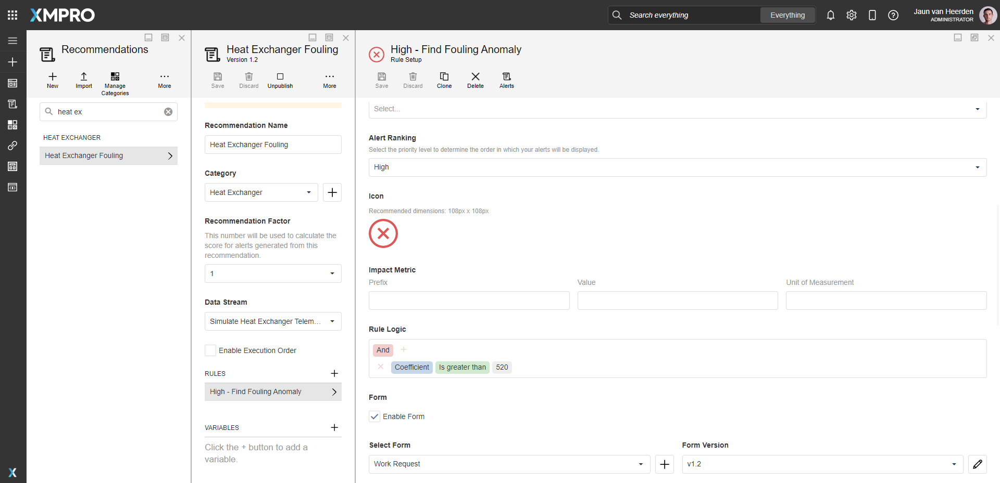
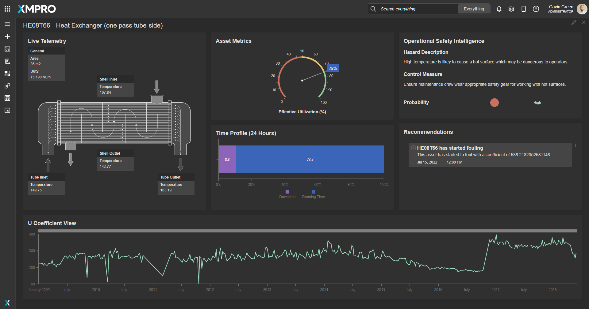
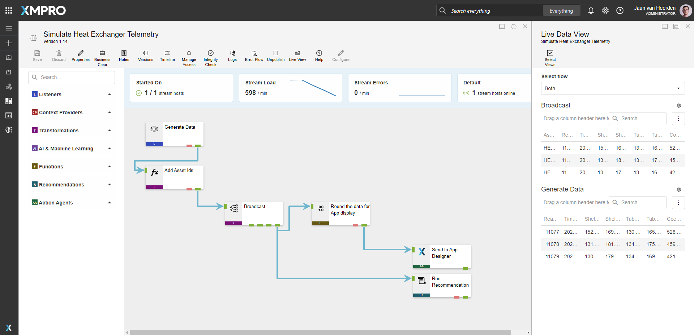
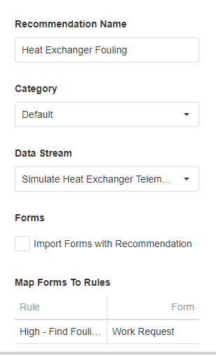

#  Smart Assets - Heat Exchanger View 

[**◄ Accelerators**](https://github.com/XMPro/Blueprints-Accelerators-Patterns/tree/master/Accelerators)

[**◄ Blueprints, Accelerators & Patterns**](https://github.com/XMPro/Blueprints-Accelerators-Patterns)


# Files

* SQL Scripts: <a href="https://github.com/XMPro/Blueprints-Accelerators-Patterns/blob/master/Accelerators/Smart%20Assets%20-%20Heat%20Exchanger%20View/SQL%20Scripts/%5BDemoHeatExchangerUCoefficient%5D.sql" target="_blank">[DemoHeatExchangerUCoefficient]</a>
* Data Stream: <a href="https://github.com/XMPro/Blueprints-Accelerators-Patterns/blob/master/Accelerators/Smart%20Assets%20-%20Heat%20Exchanger%20View/Data%20Stream/Simulate%20Heat%20Exchanger%20Telemetry.xuc" target="_blank">Simulate Heat Exchanger Telemetry</a>
* Recommendation: <a href="https://github.com/XMPro/Blueprints-Accelerators-Patterns/blob/master/Accelerators/Smart%20Assets%20-%20Heat%20Exchanger%20View/Recommendation/Heat%20Exchanger%20Fouling.xr" target="_blank">Heat Exchanger Fouling</a>
* Application: <a href="https://github.com/XMPro/Blueprints-Accelerators-Patterns/blob/master/Accelerators/Smart%20Assets%20-%20Heat%20Exchanger%20View/Application/Heat%20Exchanger%20View.xapp" target="_blank">Heat Exchanger View</a>


# Description


## SQL Scripts


### DemoHeatExchangerUCoefficient

A timeseries history of coefficient values.

<details>
<summary>Columns</summary>

```
[ID]
,[Date]
,[UCoefficient]
```
</details>


<!-- blank line -->
----
<!-- blank line -->


## Data Stream

An example of how to contextualize simulated data, calculate an oil level, run recommendations and output the wind turbine data to the Application Designer.

The data stream is configured using: 

* <a href="https://xmpro.gitbook.io/event-simulator/" target="_blank"><i>Event Simulator</i></a> <a href="https://documentation.xmpro.com/concepts/agent#listeners" target="_blank">listener</a> - Simulates data for the data stream
* <a href="https://xmpro.gitbook.io/calculated-field/" target="_blank"><i>Calculated Field</i></a> <a href="https://documentation.xmpro.com/concepts/agent#transformations" target="_blank">transformation</a> - Adding asset Ids to the data
* <a href="https://xmpro.gitbook.io/broadcast/" target="_blank"><i>Broadcast</i></a> - Broadcast data to other agents
* <a href="https://xmpro.gitbook.io/rounding/" target="_blank"><i>Rounding</i></a> <a href="https://documentation.xmpro.com/concepts/agent#transformations" target="_blank">transformation</a> - Rounding all values
* <a href="https://xmpro.gitbook.io/xmpro-app/" target="_blank"><i>XMPro App</i></a> <a href="https://documentation.xmpro.com/concepts/agent#action-agents" target="_blank">action agent</a> - View data in the App Designer
* <a href="https://xmpro.gitbook.io/run-recommendation/" target="_blank"><i>Run Recommendation</i></a> <a href="https://documentation.xmpro.com/concepts/agent#action-agents" target="_blank">action agent</a> - Run Recommendation


<details>
  <summary markdown="span">Expand to view screenshot</summary>


</details>

<!-- blank line -->
----
<!-- blank line -->


## Recommendation

The recommendation is configured using the rule: 

**Heat Exchanger Fouling**
+ Checks if the heat exchanger asset has a high fouling anomaly

<details>
<summary markdown="span">Expand to view screenshot</summary>


</details>


<!-- blank line -->
----
<!-- blank line -->

## Application
An live-data application for a heat exchanger asset, displaying metrics, usage profile, operational saftey intelligence, historical data and recommendations.


### Heat Exchanger View
The application page is configured using the following <a href="https://documentation.xmpro.com/concepts/application/block" target="_blank">blocks</a>:

* <a href="https://documentation.xmpro.com/blocks-toolbox/basic/text" target="_blank"><i>Text</i></a> to display the live data on a schematic
* <a href="https://documentation.xmpro.com/blocks-toolbox/visualizations/circular-gauge"><i>Circular Gauge</i></a> showing the effective utilization percentage
* <a href="https://documentation.xmpro.com/blocks-toolbox/visualizations/chart"><i>Charts</i></a> :
  * to visualize the historical count of equiment requiring maintenance
  * to view the usage time profile
* <a href="https://documentation.xmpro.com/blocks-toolbox/recommendations/recommendations" target="_blank"><i>Recommendations</i></a> to view current open recommendations for the asset
* <a href="https://documentation.xmpro.com/blocks-toolbox/basic/indicator" target="_blank"><i>Indicator</i></a> a visual status of the saftey indicaiton

<details>
	<summary markdown="span">Expand to view screenshot</summary>


</details>

# How to Import
Import Password: `Dem0nstr@t1on`

Create/confirm the following variables
  * App Designer URL
  * App Designer Integration Key (Encrypted)
  * SQL Server
  * SQL Username
  * SQL Password (Encrypted)

For instructions on how to import <a href="https://documentation.xmpro.com/how-tos/import-export-and-clone#importing">click here</a>

## 1. Run SQL Script

	* Execute the script in SQL Server
	* Ensure the data is succesfully loaded into the database


## 2. Import the Data Stream

    * Assign Access to others as required
	
	* Edit the XMPro agent "Send to App Designer" and ensure the URL and Integration Key are selected
	* Edit the Recommendation agent "Run Recommendation" and ensure the URL and Integration Key are selected

	* Click Apply and save the data stream (Click Save on the Action Bar, or CTRL + S on the keyboard)
	* Publish the data stream and open the live view
	* Ensure there is data in the live view at the Post telemetry agents

<details>
  <summary markdown="span">Expand to view screenshot of a successfully running data stream with live data</summary>

 
</details>


## 3. Import the Recommendation

    * Import the including form if it doesn't already exist

<details>
  <summary markdown="span">Expand to view screenshot</summary>

 

</details>

    * Assign Access to others as required

<details>
  <summary markdown="span">Expand to view screenshot</summary>

 

</details>

## 4. Import the Application

	* When importing the application make sure to map the data source on the import wizard to the above data stream that was imported
	* Confirm the connections are configured correctly in the App Data tab and in each Page Data tab

<details>
  <summary markdown="span">Expand to view screenshot</summary>

 
</details>

    * Assign Access to others as required for design and runtime

<details>
  <summary markdown="span">Expand to view screenshot</summary>

 
</details>

	* Edit the Application
    	* Select recommendation elements and tick "Heat Exchanger Fouling" in Block Properties > Behavior:
        	* Landing Page (centre-right)
  
	* Save the Application
	* Publish the application
	* Ensure there is data in the application by checking each graph, status and gauge.


## Contributing
This repository was created by <a href="https://xmpro.com/">XMPro</a>. For assistance or requests, please contact <a href="mailto:support@xmpro.com">support@xmpro.com</a>

## License
[](https://choosealicense.com/licenses/mit/)