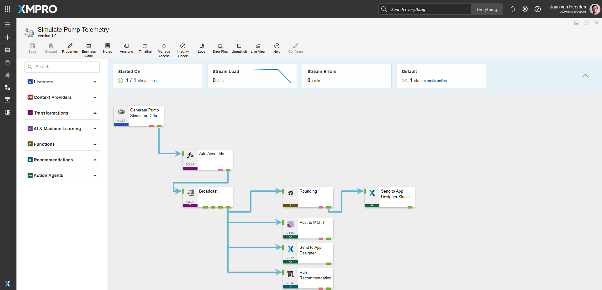
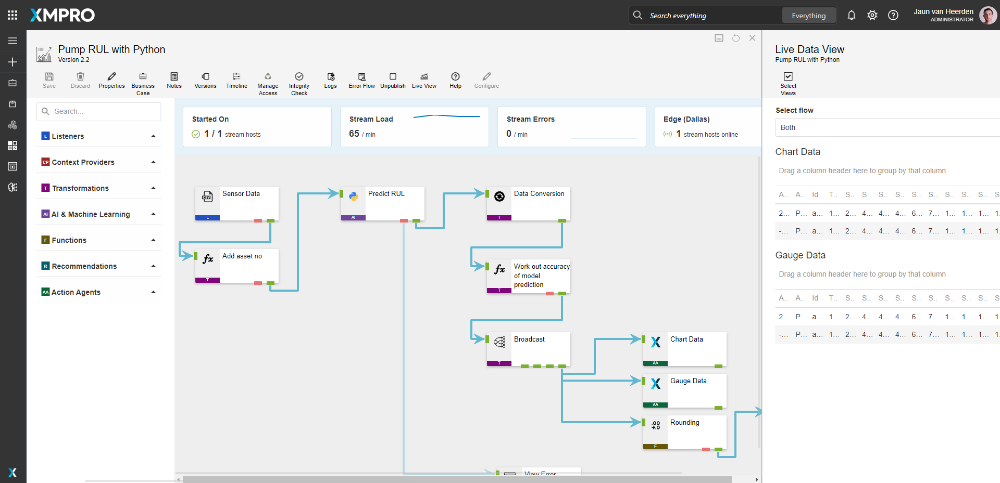

#  Smart Manufacturing - Bottling Plant 

[**◄ Accelerators**](https://github.com/XMPro/Blueprints-Accelerators-Patterns/tree/master/Accelerators)

[**◄ Blueprints, Accelerators & Patterns**](https://github.com/XMPro/Blueprints-Accelerators-Patterns)

# Table of contents
1. [Files](#files)
2. [Description](#description)
3. [How To Import](#how-to-import)


# Files 

* SQL Scripts: 
  * <a href="https://github.com/XMPro/Blueprints-Accelerators-Patterns/blob/master/Accelerators/Smart%20Manufacturing%20-%20Bottling%20Plant/SQL%20Scripts/%5BDemoBottlingPlantMapping%5D.sql" target="_blank">[DemoBottlingPlantMapping]</a>
  * <a href="https://github.com/XMPro/Blueprints-Accelerators-Patterns/blob/master/Accelerators/Smart%20Manufacturing%20-%20Bottling%20Plant/SQL%20Scripts/%5BDemoWorkManagementPump%5D.sql" target="_blank">[DemoWorkManagementPump]</a>
* Data Streams: 
  * <a href="https://github.com/XMPro/Blueprints-Accelerators-Patterns/blob/master/Accelerators/Smart%20Manufacturing%20-%20Bottling%20Plant/Data%20Stream/Bottling%20Plant%20Image%20Map%20View.xuc" target="_blank">Bottling Plant Image Map View</a>
  * <a href="https://github.com/XMPro/Blueprints-Accelerators-Patterns/blob/master/Accelerators/Smart%20Manufacturing%20-%20Bottling%20Plant/Data%20Stream/Pump%20RUL%20with%20Python.xuc" target="_blank">Pump RUL with Python</a>
  * <a href="https://github.com/XMPro/Blueprints-Accelerators-Patterns/blob/master/Accelerators/Smart%20Manufacturing%20-%20Bottling%20Plant/Data%20Stream/Simulate%20Pump%20Telemetry.xuc" target="_blank">Simulate Pump Telemetry</a>
  * <a href="https://github.com/XMPro/Blueprints-Accelerators-Patterns/blob/master/Accelerators/Smart%20Manufacturing%20-%20Bottling%20Plant/Data%20Stream/Streaming%20Data%20Platform%20Simulator.xuc" target="_blank">Streaming Data Platform Simulator</a>
  * <a href="https://github.com/XMPro/Blueprints-Accelerators-Patterns/blob/master/Accelerators/Smart%20Manufacturing%20-%20Bottling%20Plant/Data%20Stream/Tank%20Leak%20Detection.xuc" target="_blank">Tank Leak Detection</a>
* Recommendations: 
  * <a href="https://github.com/XMPro/Blueprints-Accelerators-Patterns/blob/master/Accelerators/Smart%20Manufacturing%20-%20Bottling%20Plant/Recommendation/Image%20Defect.xr" target="_blank">Image Defect</a>
  * <a href="https://github.com/XMPro/Blueprints-Accelerators-Patterns/blob/master/Accelerators/Smart%20Manufacturing%20-%20Bottling%20Plant/Recommendation/Pump%20RUL.xr" target="_blank">Pump RUL</a>
  * <a href="https://github.com/XMPro/Blueprints-Accelerators-Patterns/blob/master/Accelerators/Smart%20Manufacturing%20-%20Bottling%20Plant/Recommendation/Tank%20Leak%20Detection.xr" target="_blank">Tank Leak Detection</a>
* Application:
  * <a href="https://github.com/XMPro/Blueprints-Accelerators-Patterns/blob/master/Accelerators/Smart%20Manufacturing%20-%20Bottling%20Plant/Application/Bottle%20Filling%20Processing%20Plant%20Administration.xapp" target="_blank">Bottle Filling Processing Plant Administration</a>
  * <a href="https://github.com/XMPro/Blueprints-Accelerators-Patterns/blob/master/Accelerators/Smart%20Manufacturing%20-%20Bottling%20Plant/Application/Bottling%20Plant%20Operational%20View.xapp" target="_blank">Bottling Plant Operational View</a>


# Description


## SQL Scripts


### DemoBottlingPlantMapping

A list of assets and other details.

<details>
<summary>Columns</summary>

```
[ID]
,[AssetNo]
,[Description]
,[Active]
,[X]
,[Y]
```
</details>


### DemoWorkManagementPump

Work management information.

<details>
<summary>Columns</summary>

```
[ID]
,[AssetNo]
,[WRNo]
,[WONo]
,[Title]
,[WOStatus]
,[Date]
```
</details>


<!-- blank line -->
----
<!-- blank line -->


## Data Stream

### Data Stream Table Of Contents
1. [Bottling Plant Image View](#btlplantimgmap)
2. [Pump RUL](#pumprul)
3. [Simulate Pump Telemetry](#simulatepumptelem)
4. [Streaming Data Platform Simulator](#strmdatapltfrmsim)
5. [Tank Leak Detection](#tankleakdetection)

<a name="btlplantimgmap"></a>
**Bottling Plant Image Map View** 

Set indicator status based on alerts from the recommendations.

The data stream is configured using: 

* <a href="https://xmpro.gitbook.io/azure-sql/" target="_blank"><i>SQL</i></a> <a href="https://documentation.xmpro.com/concepts/agent#listeners" target="_blank">listener</a> - Read asset information from SQL
* <a href="https://xmpro.gitbook.io/read-recommendation/" target="_blank"><i>Read Recommendation</i></a> <a href="https://documentation.xmpro.com/concepts/agent#recommendations" target="_blank">agent</a> - Read a set of active recommendations
* <a href="https://xmpro.gitbook.io/join/" target="_blank"><i>Join</i></a> <a href="https://documentation.xmpro.com/concepts/agent#transformations" target="_blank">transformation</a> - Contextualize recommendations with data from SQL
* <a href="https://xmpro.gitbook.io/calculated-field/" target="_blank"><i>Calculated Field</i></a> <a href="https://documentation.xmpro.com/concepts/agent#transformations" target="_blank">transformations</a>
  * Merge asset data and recommendations
  * Add a weight to rule priority
  * Calculate display color
* <a href="https://xmpro.gitbook.io/aggregate/" target="_blank"><i>Aggregate</i></a> <a href="https://documentation.xmpro.com/concepts/agent#transformations" target="_blank">transformation</a> - Bubble up red and yellow status
* <a href="https://xmpro.gitbook.io/xmpro-app/" target="_blank"><i>XMPro App</i></a> <a href="https://documentation.xmpro.com/concepts/agent#action-agents" target="_blank">action agent</a> - View data on the Image Map

<details>
  <summary markdown="span">Expand to view screenshot</summary>


</details>

<a name="pumprul"></a>
**Pump RUL with Python** 

Predicting Remaining Useful Life (RUL) of an asset using machine learning models.

The data stream is configured using: 

* <a href="https://xmpro.gitbook.io/csv/" target="_blank"><i>CSV Simulator</i></a> <a href="https://documentation.xmpro.com/concepts/agent#listeners" target="_blank">listener</a> - Simulate sensor data
* <a href="https://xmpro.gitbook.io/calculated-field/" target="_blank"><i>Calculated Field</i></a> <a href="https://documentation.xmpro.com/concepts/agent#transformations" target="_blank">transformation</a>
  * Add Asset number
  * Calculate accuracy of model prediction
* <a href="https://xmpro.gitbook.io/python/" target="_blank"><i>Python</i></a> <a href="https://documentation.xmpro.com/concepts/agent#action-agents" target="_blank">action agent</a> - Run machine learning model to predict RUL
* <a href="https://xmpro.gitbook.io/data-conversion" target="_blank"><i>Data Conversion</i></a> <a href="https://documentation.xmpro.com/concepts/agent#transformations" target="_blank">transformation</a> - Convert data into the correct type
* <a href="https://xmpro.gitbook.io/broadcast/" target="_blank"><i>Broadcast</i></a> - Broadcast data to other agents
* <a href="https://xmpro.gitbook.io/xmpro-app/" target="_blank"><i>XMPro App</i></a> <a href="https://documentation.xmpro.com/concepts/agent#action-agents" target="_blank">action agents</a>
  * *Chart Data* is configured with a cache of 20 for the historic data
  * *Gauge Data* is configured with a cache of 1 for live status
* <a href="https://xmpro.gitbook.io/rounding/" target="_blank"><i>Rounding</i></a> <a href="https://documentation.xmpro.com/concepts/agent#transformations" target="_blank">transformation</a> - Rounding all values
* <a href="https://xmpro.gitbook.io/run-recommendation/" target="_blank"><i>Run Recommendation</i></a> <a href="https://documentation.xmpro.com/concepts/agent#recommendations" target="_blank">agent</a> - Run Recommendation rules

<details>
  <summary markdown="span">Expand to view screenshot</summary>


</details>

<a name="simulatepumptelem"></a>
**Simulate Pump Telemetry**

An example of simulated pump telemetry data - broadcasting out via MQTT.

The data stream is configured using:

* <a href="https://xmpro.gitbook.io/event-simulator/" target="_blank"><i>Event Simulator</i></a> <a href="https://documentation.xmpro.com/concepts/agent#listeners" target="_blank">listener</a> - Simulates data for the stream
* <a href="https://xmpro.gitbook.io/calculated-field/" target="_blank"><i>Calculated Field</i></a> <a href="https://documentation.xmpro.com/concepts/agent#transformations" target="_blank">transformation</a> - Adding an Asset number
* <a href="https://xmpro.gitbook.io/broadcast/" target="_blank"><i>Broadcast</i></a> - Broadcast data to other agents
* <a href="https://xmpro.gitbook.io/rounding/" target="_blank"><i>Rounding</i></a> <a href="https://documentation.xmpro.com/concepts/agent#transformations" target="_blank">transformation</a> - Rounding all values
* <a href="https://xmpro.gitbook.io/xmpro-app/" target="_blank"><i>XMPro App</i></a> <a href="https://documentation.xmpro.com/concepts/agent#action-agents" target="_blank">action agents</a>
  * *Send Data to App Designer is configured with a cache of 20 for the historic data
  * *Send Data to App Designer Single* is configured with a cache of 1 for live status
* <a href="https://xmpro.gitbook.io/mqtt/" target="_blank"><i>MQTT</i></a> <a href="https://documentation.xmpro.com/concepts/agent#action-agents" target="_blank">action agent</a> - Emit data via MQTT
* <a href="https://xmpro.gitbook.io/run-recommendation/" target="_blank"><i>Run Recommendation</i></a> <a href="https://documentation.xmpro.com/concepts/agent#recommendations" target="_blank">agent</a> - Run Recommendation rules

<details>
  <summary markdown="span">Expand to view screenshot</summary>


</details>

<a name="strmdatapltfrmsim"></a>
**Streaming Data Platform Simulator**

Streaming image detection data.

The data stream is configured using: 

* <a href="https://xmpro.gitbook.io/csv/" target="_blank"><i>CSV Simulator</i></a> <a href="https://documentation.xmpro.com/concepts/agent#listeners" target="_blank">listener</a> - Simulate sensor data
* <a href="https://xmpro.gitbook.io/filter/" target="_blank"><i>Filter</i></a> <a href="https://documentation.xmpro.com/concepts/agent#transformations" target="_blank">transformation</a> - Filter out data without images
* <a href="https://xmpro.gitbook.io/calculated-field/" target="_blank"><i>Calculated Field</i></a> <a href="https://documentation.xmpro.com/concepts/agent#transformations" target="_blank">transformation</a> - Clean data
* <a href="https://xmpro.gitbook.io/broadcast/" target="_blank"><i>Broadcast</i></a> - Broadcast data to other agents
* <a href="https://xmpro.gitbook.io/alter-attributes/" target="_blank"><i>Alter Attributes</i></a> <a href="https://documentation.xmpro.com/concepts/agent#action-agents" target="_blank">action agent</a> - change order, set aliases and exclude specific columns
* <a href="https://xmpro.gitbook.io/xmpro-app/" target="_blank"><i>XMPro App</i></a> <a href="https://documentation.xmpro.com/concepts/agent#action-agents" target="_blank">action agents</a>
  * *Send Data to App* is configured with a cache of 5 for the historic data
  * *Send Overview* is configured with a cache of 1 for live status
  * *View Defect Image* is configured with a cache of 1 for live status
* <a href="https://xmpro.gitbook.io/run-recommendation/" target="_blank"><i>Run Recommendation</i></a> <a href="https://documentation.xmpro.com/concepts/agent#recommendations" target="_blank">agent</a> - Run Recommendation rules

<details>
  <summary markdown="span">Expand to view screenshot</summary>


</details>

<a name="tankleakdetection"></a>
**Tank Leak Detection**

A data stream used to detect leaks in a tank system.

The data stream is configured using:

* <a href="https://xmpro.gitbook.io/csv/" target="_blank"><i>CSV Simulator</i></a> <a href="https://documentation.xmpro.com/concepts/agent#listeners" target="_blank">listener</a> - Simulate sensor data
* <a href="https://xmpro.gitbook.io/calculated-field/" target="_blank"><i>Calculated Field</i></a> <a href="https://documentation.xmpro.com/concepts/agent#transformations" target="_blank">transformation</a>
  * Add identifiers
  * Get first and last value for each dataset
* <a href="https://xmpro.gitbook.io/broadcast/" target="_blank"><i>Broadcast</i></a> - Broadcast data to other agents
* <a href="https://xmpro.gitbook.io/xmpro-app/" target="_blank"><i>XMPro App</i></a> <a href="https://documentation.xmpro.com/concepts/agent#action-agents" target="_blank">action agents</a>
  * *View Chart Data* is configured with a cache of 10 for the historic data
  * *View Live Data* is configured with a cache of 1 for live status
  * *View Data* is configured with a cache of 1 for live status
* <a href="https://xmpro.gitbook.io/xmpro-app/" target="_blank"><i>Window</i></a> <a href="https://documentation.xmpro.com/concepts/agent#action-agents" target="_blank">action agent</a> - Wait for data
* <a href="https://xmpro.gitbook.io/data-conversion" target="_blank"><i>Data Conversion</i></a> <a href="https://documentation.xmpro.com/concepts/agent#transformations" target="_blank">transformation</a> - Rename the columns
* <a href="https://xmpro.gitbook.io/data-conversion" target="_blank"><i>Concatenate</i></a> <a href="https://documentation.xmpro.com/concepts/agent#concatenate" target="_blank">transformation</a> - Concatenate row values
* <a href="https://xmpro.gitbook.io/alter-attributes/" target="_blank"><i>Alter Attributes</i></a> <a href="https://documentation.xmpro.com/concepts/agent#action-agents" target="_blank">action agent</a> - change order, set aliases and exclude specific columns
* <a href="https://xmpro.gitbook.io/run-recommendation/" target="_blank"><i>Run Recommendation</i></a> <a href="https://documentation.xmpro.com/concepts/agent#recommendations" target="_blank">agent</a> - Run Recommendation rules

<details>
  <summary markdown="span">Expand to view screenshot</summary>


</details>


<!-- blank line -->
----
<!-- blank line -->


## Recommendation


### Recommendation Table Of Contents

1. [Image Defect](#imgdefect)
2. [Pump RUL](#recpumprul)
3. [RUL Prediction](#rulpredict)
4. [Tank Leak Detection](#tankleak)
5. [Leak Scenario 1](#leakscenario1)
6. [Leak Scenario 2](#leakscenario2)
7. [Outlet Pipeline Blockage](#outletpipeln)
8. [Top Valve Passing Scenario 1](#topvalvpassscn1)
9. [Top Valve Passing Scenario 2](#topvalvpassscn2)


<a name="imgdefect"></a>

**Image Defect**

The recommendation is configured using the rule:

Defect Found - Alerts when an image is identified as `bad`


<details>
<summary markdown="span">Expand to view screenshot</summary>


</details>

<a name="recpumprul"></a>

**Pump RUL**

The recommendation is configured using two rules:

Accuracy - Alerts once the model accuracy is out by a specified percentage

<details>
<summary markdown="span">Expand to view screenshot</summary>


</details>

<a name="rulpredict"></a>

**RUL Prediction** 
Alerts when the remaining useful life is below a specific level

<details>
<summary markdown="span">Expand to view screenshot</summary>


</details>

<a name="tankleak"></a>

**Tank Leak Detection**

The recommendation is configured using the following rules:


Inlet Pipeline Blockage - when there is a discrepancy with expected pipe flow

<details>
<summary markdown="span">Expand to view screenshot</summary>


</details>

<a name="leakscenario1"></a>

**Leak Scenario 1**
Checks for leak for specific valve output values

<details>
<summary markdown="span">Expand to view screenshot</summary>


</details>

<a name="leakscenario2"></a>

**Leak Scenario 2**
Checks for leak for specific output values

<details>
<summary markdown="span">Expand to view screenshot</summary>


</details>

<a name="outletpipeln"></a>

**Outlet Pipeline Blockage**
Detects when there is a outlet pipeline blockage

<details>
<summary markdown="span">Expand to view screenshot</summary>


</details>

<a name="topvalvpassscn1"></a>

**Top Valve Passing Scenario 1**
Detects flow discrepancy with top valve passing for specific output values

<details>
<summary markdown="span">Expand to view screenshot</summary>


</details>

<a name="topvalvpassscn2"></a>

**Top Valve Passing Scenario 2**
Detects flow discrepancy with top valve passing for specific output values

<details>
<summary markdown="span">Expand to view screenshot</summary>


</details>


<!-- blank line -->
----
<!-- blank line -->

## Application
An example of how to visualize the synthetic data passed by the data stream to a Unity model in an application.


**Bottling Plant Operational View**

### Landing Page
The application page is configured using the following <a href="https://documentation.xmpro.com/concepts/application/block" target="_blank">blocks</a>:
* <a href="https://documentation.xmpro.com/blocks-toolbox/recommendations/recommendations" target="_blank"><i>Recommendations</i></a> to view current open recommendations
* <a href="https://documentation.xmpro.com/blocks-toolbox/basic/indicator" target="_blank"><i>Indicator</i></a> the visual status of the stages
* <a href="https://documentation.xmpro.com/blocks-toolbox/visualizations/pie-chart" target="_blank"><i>Pie Chart</i></a> current months downtime by cause
* <a href="https://documentation.xmpro.com/blocks-toolbox/basic/text" target="_blank"><i>Text</i></a> to display the live data
* <a href="https://documentation.xmpro.com/blocks-toolbox/visualizations/image-map" target="_blank"><i>Image Map</i></a> to displaya schematic of the bottling process
* <a href="https://documentation.xmpro.com/blocks-toolbox/visualizations/d3-visualization" target="_blank"><i>D3 Visualisation</i></a> to display an a matrix of the defect trends


<details>
<summary markdown="span">Expand to view screenshot</summary>


</details>


### Pump Drilldown
The application page is configured using the following <a href="https://documentation.xmpro.com/concepts/application/block" target="_blank">blocks</a>:


* <a href="https://documentation.xmpro.com/blocks-toolbox/visualizations/chart" target="_blank"><i>Charts</i></a>:
  *  time profile (24 Hours)
  *  Actual vs Predicted RUL (Hrs)
  *  Real-time view
* <a href="https://documentation.xmpro.com/blocks-toolbox/visualizations/unity-1" target="_blank"><i>Unity (Legacy)</i></a> ro render a unity model of a pump
* <a href="https://documentation.xmpro.com/blocks-toolbox/visualizations/circular-gauge"><i>Circular Gauge</i></a> showing the effective utilization percentage
* <a href="https://documentation.xmpro.com/blocks-toolbox/basic/indicator" target="_blank"><i>Indicator</i></a> to visually inspect the risk status of the assets 
* <a href="https://documentation.xmpro.com/blocks-toolbox/recommendations/recommendations" target="_blank"><i>Recommendations</i></a> to view current open recommendations
* <a href="https://documentation.xmpro.com/blocks-toolbox/basic/data-grid" target="_blank"><i>Data Grid</i></a> presenting the data for each asset


<details>
<summary markdown="span">Expand to view screenshot</summary>


</details>


### Tank Drilldown
The application page is configured using the following <a href="https://documentation.xmpro.com/concepts/application/block" target="_blank">blocks</a>:

* <a href="https://documentation.xmpro.com/blocks-toolbox/basic/text" target="_blank"><i>Text</i></a> to display the live data
* <a href="https://documentation.xmpro.com/blocks-toolbox/basic/indicator" target="_blank"><i>Indicator</i></a> to show the operational safety intelligence status 
* <a href="https://documentation.xmpro.com/blocks-toolbox/visualizations/chart" target="_blank"><i>Chart</i></a> a graph to show the real-time data
* <a href="https://documentation.xmpro.com/blocks-toolbox/recommendations/recommendations" target="_blank"><i>Recommendations</i></a> to view current open recommendations


<details>
<summary markdown="span">Expand to view screenshot</summary>


</details>


### Conveyor Drilldown
The application page is configured using the following <a href="https://documentation.xmpro.com/concepts/application/block" target="_blank">blocks</a>:

* <a href="https://documentation.xmpro.com/blocks-toolbox/recommendations/recommendations" target="_blank"><i>Recommendations</i></a> to view current open recommendations
* <a href="https://documentation.xmpro.com/blocks-toolbox/basic/text" target="_blank"><i>Text</i></a> to display the live data
* <a href="https://documentation.xmpro.com/blocks-toolbox/image/image" target="_blank"><i>Image</i></a> to display the last identified defect image
* <a href="https://documentation.xmpro.com/blocks-toolbox/image/embedded-page" target="_blank"><i>Embedded Page</i></a> to display the a video of the process line
* <a href="https://documentation.xmpro.com/blocks-toolbox/visualizations/circular-gauge"><i>Circular Gauge</i></a> for OEE calculation:
  * Availability (%)
  * Performance (%)
  * Quality (%)


<details>
<summary markdown="span">Expand to view screenshot</summary>


</details>


**Brewing Process Administration**

### Landing Page
The application page is configured using the following <a href="https://documentation.xmpro.com/concepts/application/block" target="_blank">blocks</a>:

* <a href="https://documentation.xmpro.com/blocks-toolbox/basic/data-grid" target="_blank"><i>Data Grid</i></a> presenting the data for each process stage


<details>
<summary markdown="span">Expand to view screenshot</summary>


</details>


# How to Import
Import Password: `Dem0nstr@t1on`

Create/confirm the following variables
  * App Designer URL
  * App Designer Integration Key (Encrypted)
  * SQL Server
  * SQL Username
  * SQL Password (Encrypted)

For instructions on how to import <a href="https://documentation.xmpro.com/how-tos/import-export-and-clone#importing">click here</a>


## 1. Run SQL Scripts

	* Execute the scripts in SQL Server
	* Ensure the data is successfully loaded into the database


## 2. Import the Data Streams

    * Assign Access to others as required
	
	* Edit the XMPro agents and ensure the URL and Integration Key are selected
	* Edit the Recommendation agents and ensure the URL and Integration Key are selected
	* Edit the Azure SQL agents and ensure the Server Instance, Username and Password fields are filled in correctly

	* Click Apply and save the data stream (Click Save on the Action Bar, or CTRL + S on the keyboard)
	* Publish the data stream and open the live view
	* Ensure there is data in the live view at the Post telemetry agents


Expand to view screenshot of a successfully running data stream with live data:
<details>
  <summary markdown="span">Bottling Plant Image Map View</summary>

 
</details>

<details>
  <summary markdown="span">Pump RUL with Python</summary>

 
</details>

<details>
  <summary markdown="span">Simulate Pump Telemetry</summary>

 
</details>

<details>
  <summary markdown="span">Streaming Data Platform Simulator</summary>

 
</details>

<details>
  <summary markdown="span"> Tank Leak Detection</summary>

 
</details>


## 3. Import the Recommendations

    * Import the including form if it doesn't already exist

<details>
  <summary markdown="span">Expand to view screenshot</summary>

 

</details>

    * Assign Access to others as required

<details>
  <summary markdown="span">Expand to view screenshot</summary>

 

</details>

## 4. Import the Applications

	* When importing the application make sure to map the data source on the import wizard to the above data stream that was imported
	* Confirm the connections are configured correctly in the App Data tab and in each Page Data tab

<details>
  <summary markdown="span">Expand to view screenshot</summary>

 
</details>

    * Assign Access to others as required for design and runtime

<details>
  <summary markdown="span">Expand to view screenshot</summary>

 
</details>

	* Edit the Application
    	* Select recommendation elements and tick in Block Properties > Behavior:
        	* "Pump RUL"
        	* "Tank Leak Detection"
        	* "Image Defect"
      	* For pages:
        	* Landing Page (top-left)
        	* Pump Drilldown (bottom-right)
        	* Tank Drilldown (bottom-right)
        	* Conveyor Drilldown (bottom-right)

	* Save the Application
	* Publish the application
	* Ensure there is data in the application by checking each graph, status and gauge.

<!-- <details>
  <summary markdown="span">Expand to view screenshot</summary>

 
</details> -->

## Contributing
This repository was created by <a href="https://xmpro.com/">XMPro</a>. For assistance or requests, please contact <a href="mailto:support@xmpro.com">support@xmpro.com</a>

## License
[](https://choosealicense.com/licenses/mit/)