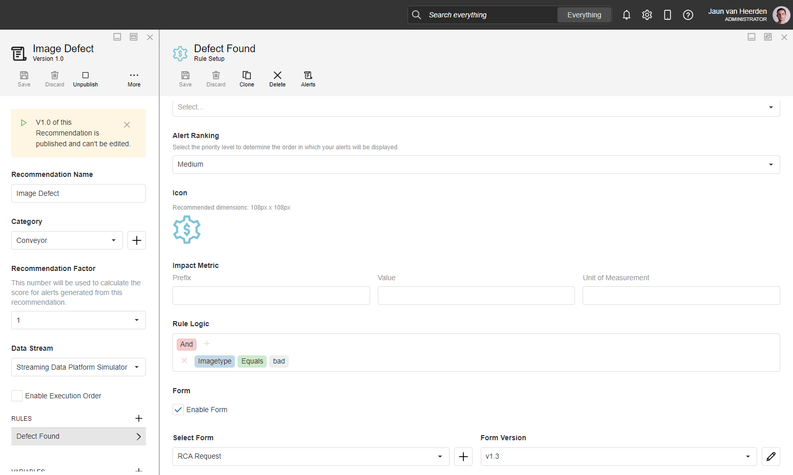
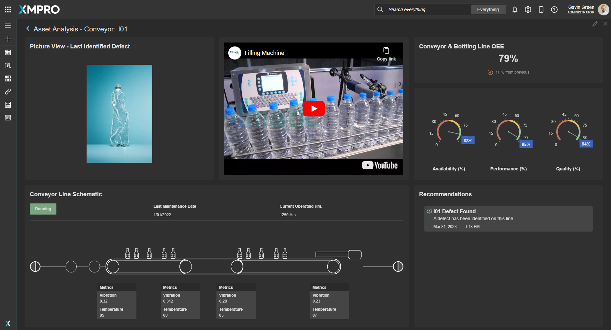
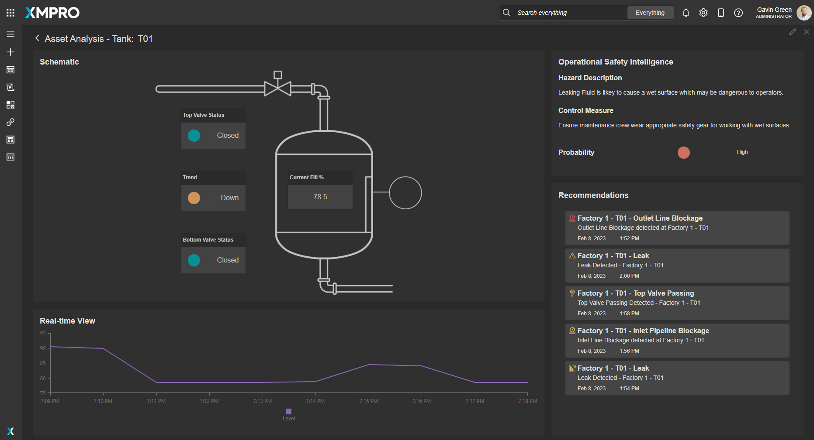

#  Alternative Energy - Renewable View 

[**◄ Accelerators**](https://github.com/XMPro/Blueprints-Accelerators-Patterns/tree/master/Accelerators)

[**◄ Blueprints, Accelerators & Patterns**](https://github.com/XMPro/Blueprints-Accelerators-Patterns)

# Files

* SQL Scripts: 
  * <a href="https://github.com/XMPro/Blueprints-Accelerators-Patterns/blob/master/Accelerators/Smart%20Manufacturing%20-%20Bottling%20Plant/SQL%20Scripts/%5BDemoBottlingPlantMapping%5D.sql" target="_blank">[DemoBottlingPlantMapping]</a>
  * <a href="https://github.com/XMPro/Blueprints-Accelerators-Patterns/blob/master/Accelerators/Smart%20Manufacturing%20-%20Bottling%20Plant/SQL%20Scripts/%5BDemoWorkManagementPump%5D.sql" target="_blank">[DemoWorkManagementPump]</a>
* Data Streams: 
  * <a href="https://github.com/XMPro/Blueprints-Accelerators-Patterns/blob/master/Accelerators/Smart%20Manufacturing%20-%20Bottling%20Plant/Data%20Stream/Bottling%20Plant%20Image%20Map%20View.xuc" target="_blank">Bottling Plant Image Map View</a>
  * <a href="https://github.com/XMPro/Blueprints-Accelerators-Patterns/blob/master/Accelerators/Smart%20Manufacturing%20-%20Bottling%20Plant/Rule%20Management/Pump%20RUL%20with%20Python.xuc" target="_blank">Pump RUL with Python</a>
  * <a href="https://github.com/XMPro/Blueprints-Accelerators-Patterns/blob/master/Accelerators/Smart%20Manufacturing%20-%20Bottling%20Plant/Data%20Stream/Simulate%20Pump%20Telemetry.xuc" target="_blank">Simulate Pump Telemetry</a>
  * <a href="https://github.com/XMPro/Blueprints-Accelerators-Patterns/blob/master/Accelerators/Smart%20Manufacturing%20-%20Bottling%20Plant/Data%20Stream/Streaming%20Data%20Platform%20Simulator.xuc" target="_blank">Streaming Data Platform Simulator</a>
  * <a href="https://github.com/XMPro/Blueprints-Accelerators-Patterns/blob/master/Accelerators/Smart%20Manufacturing%20-%20Bottling%20Plant/Reccomendation/Tank%20Reccomendation.xuc" target="_blank">Tank Leak Detection</a>
* Recommendations: 
  * <a href="https://github.com/XMPro/Blueprints-Accelerators-Patterns/blob/jaun-edit/Accelerators/Smart%20Manufacturing%20-%20Bottling%20Plant/Recommendation/Image%20Defect.xr" target="_blank">Image Defect</a>
  * <a href="https://github.com/XMPro/Blueprints-Accelerators-Patterns/blob/jaun-edit/Accelerators/Smart%20Manufacturing%20-%20Bottling%20Plant/Recommendation/Pump%20RUL.xr" target="_blank">Pump RUL</a>
  * <a href="https://github.com/XMPro/Blueprints-Accelerators-Patterns/blob/jaun-edit/Accelerators/Smart%20Manufacturing%20-%20Bottling%20Plant/Recommendation/Tank%20Leak%20Detection.xr" target="_blank">Tank Leak Detection</a>
* Application:
  * <a href="https://github.com/XMPro/Blueprints-Accelerators-Patterns/blob/jaun-edit/Accelerators/Smart%20Manufacturing%20-%20Bottling%20Plant/Application/Bottle%20Filling%20Processing%20Plant%20Administration.xapp" target="_blank">Bottle Filling Processing Plant Administration</a>
  * <a href="https://github.com/XMPro/Blueprints-Accelerators-Patterns/blob/jaun-edit/Accelerators/Smart%20Manufacturing%20-%20Bottling%20Plant/Application/Bottling%20Plant%20Operational%20View.xapp" target="_blank">Bottling Plant Operational View</a>


# Description


## SQL Scripts


### DemoBottlingPlantMapping

A list of assets and other details.

<details>
<summary>Columns</summary>

```
[ID]
,[AssetNo]
,[Description]
,[Active]
,[X]
,[Y]
```
</details>


### DemoWorkManagementPump

Work management information.

<details>
<summary>Columns</summary>

```
[ID]
,[AssetNo]
,[WRNo]
,[WONo]
,[Title]
,[WOStatus]
,[Date]
```
</details>


<!-- blank line -->
----
<!-- blank line -->


## Data Stream


**Bottling Plant Image Map View**

An example of X

The data stream is configured using: 


**Pump RUL with Python**

An example of X

The data stream is configured using: 


**Simulate Pump Telemetry**

An example of X

The data stream is configured using: 


**Streaming Data Platform Simulator**

An example of X

The data stream is configured using: 


**Tank Leak Detection**

An example of X

The data stream is configured using: 


<details>
  <summary markdown="span">Expand to view screenshot</summary>


</details>

<!-- blank line -->
----
<!-- blank line -->


## Recommendation


**Image Defect**

The recommendation is configured using two rules:

<details>
<summary markdown="span">Expand to view screenshot</summary>


</details>


**Pump RUL**

The recommendation is configured using two rules:

<details>
<summary markdown="span">Expand to view screenshot</summary>


</details>


**Tank Leak Detection**

The recommendation is configured using two rules:

<details>
<summary markdown="span">Expand to view screenshot</summary>


</details>

<!-- blank line -->
----
<!-- blank line -->

## Application
An example of how to vizualize the synthetic data passed by the data stream to a Unity model in an application.


**Bottling Plant Operational View**

### Pump Drilldown
The application page is configured using the following <a href="https://documentation.xmpro.com/concepts/application/block" target="_blank">blocks</a>:

<details>
<summary markdown="span">Expand to view screenshot</summary>


</details>


### Tank Drilldown
The application page is configured using the following <a href="https://documentation.xmpro.com/concepts/application/block" target="_blank">blocks</a>:

<details>
<summary markdown="span">Expand to view screenshot</summary>


</details>


### Conveyor Drilldown
The application page is configured using the following <a href="https://documentation.xmpro.com/concepts/application/block" target="_blank">blocks</a>:

<details>
<summary markdown="span">Expand to view screenshot</summary>


</details>


**Brewing Process Administration**

### Landing Page
The application page is configured using the following <a href="https://documentation.xmpro.com/concepts/application/block" target="_blank">blocks</a>:

<details>
<summary markdown="span">Expand to view screenshot</summary>


</details>


# How to Import
Import Password: `Dem0nstr@t1on`

Create/confirm the following variables
  * App Designer URL
  * App Designer Integration Key (Encrypted)
  * SQL Server
  * SQL Username
  * SQL Password (Encrypted)

For instructions on how to import <a href="https://documentation.xmpro.com/how-tos/import-export-and-clone#importing">click here</a>


## 1. Run SQL Scripts

	* Execute the scripts in SQL Server
	* Ensure the data is succesfully loaded into the database


## 2. Import the Data Stream

    * Assign Access to others as required
	
	* Edit the XMPro agents and ensure the URL and Integration Key are selected
	* Edit the Recommendation agents and ensure the URL and Integration Key are selected
	* Edit the Azure SQL agents and ensure the Server Instance, Username and Password fields are filled in correctly

	* Click Apply and save the data stream (Click Save on the Action Bar, or CTRL + S on the keyboard)
	* Publish the data stream and open the live view
	* Ensure there is data in the live view at the Post telemetry agents


Expand to view screenshot of a successfully running data stream with live data:
<details>
  <summary markdown="span">Bottling Plant Image Map View</summary>

 
</details>

<details>
  <summary markdown="span">Pump RUL with Python</summary>

 
</details>

<details>
  <summary markdown="span">Simulate Pump Telemetry</summary>

 
</details>

<details>
  <summary markdown="span">Streaming Data Platform Simulator</summary>

 
</details>

<details>
  <summary markdown="span"> Tank Leak Detection</summary>

 
</details>


  
  
 
  
  


## 3. Import the Recommendation

    * Import the including form if it doesn't already exist

<details>
  <summary markdown="span">Expand to view screenshot</summary>

 

</details>

    * Assign Access to others as required

<details>
  <summary markdown="span">Expand to view screenshot</summary>

 

</details>

## 4. Import the Application

	* When importing the application make sure to map the data source on the import wizard to the above data stream that was imported
	* Confirm the connections are configured correctly in the App Data tab and in each Page Data tab

<details>
  <summary markdown="span">Expand to view screenshot</summary>

 
</details>

    * Assign Access to others as required for design and runtime

<details>
  <summary markdown="span">Expand to view screenshot</summary>

 
</details>

	* Edit the Application
    	* Select all recommendation elements on all pages and tick "Oil" in Block Properties > Behavior:
        	* Landing Page (top-right)
        	* Asset View (bottom-right)
        	* Asset Drilldown (center-left)

	* Save the Application
	* Publish the application
	* Ensure there is data in the applciation by checking each graph, status and gauge.

<!-- <details>
  <summary markdown="span">Expand to view screenshot</summary>

 
</details> -->

## Contributing
This repository was created by <a href="https://xmpro.com/">XMPro</a>. For assistance or requests, please contact <a href="mailto:support@xmpro.com">support@xmpro.com</a>

## License
[](https://choosealicense.com/licenses/mit/)


