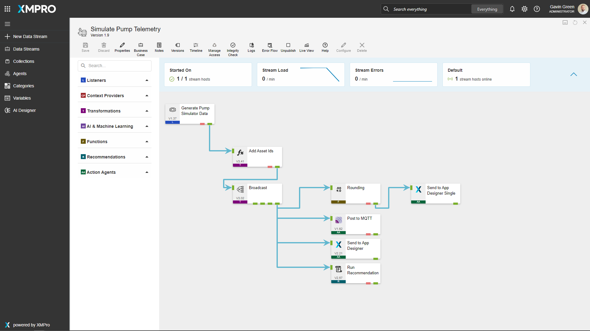
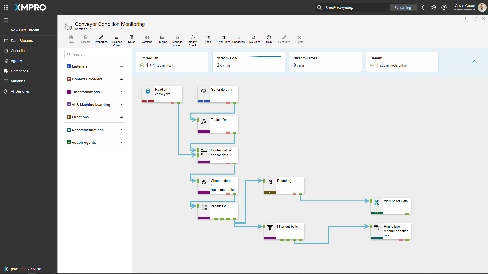
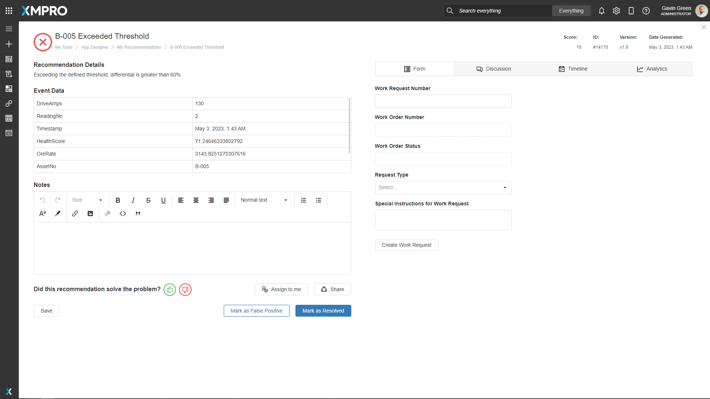
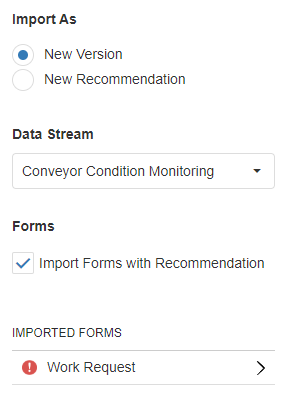
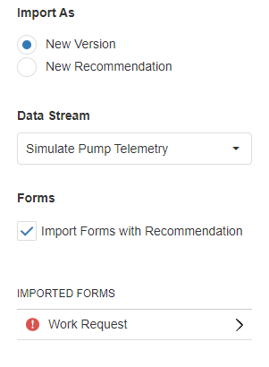

#  Smart Mining - Surface Processing Plant 

[**◄ Accelerators**](https://github.com/XMPro/Blueprints-Accelerators-Patterns/tree/master/Accelerators)

[**◄ Blueprints, Accelerators & Patterns**](https://github.com/XMPro/Blueprints-Accelerators-Patterns)

# Files

* SQL Scripts: <a href="https://github.com/XMPro/Blueprints-Accelerators-Patterns/blob/master/Accelerators/Smart%20Mining%20-%20Surface%20Processing%20Plant/SQL%20Scripts/%5BDemoSTPPlantMapping%5D.sql" target="_blank">[DemoSTPPIantMapping]</a> , 
<a href="https://github.com/XMPro/Blueprints-Accelerators-Patterns/blob/master/Accelerators/Smart%20Mining%20-%20Surface%20Processing%20Plant/SQL%20Scripts/%5BDemoWorkManagementPump%5D.sql" target="_blank">[DemoWorkManagementPump]</a>
* Data Stream: <a href="https://github.com/XMPro/Blueprints-Accelerators-Patterns/blob/master/Accelerators/Smart%20Mining%20-%20Surface%20Processing%20Plant/Data%20Stream/Processing%20Plant%20Image%20Map%20View.xuc" target="_blank">Processing Plant Image Map View</a>, <a href="https://github.com/XMPro/Blueprints-Accelerators-Patterns/blob/master/Accelerators/Smart%20Mining%20-%20Surface%20Processing%20Plant/Data%20Stream/Simulate%20Pump%20Telemetry.xuc" target="_blank">Simulate Pump Telemetry</a>, <a href="https://github.com/XMPro/Blueprints-Accelerators-Patterns/blob/master/Accelerators/Smart%20Mining%20-%20Surface%20Processing%20Plant/Data%20Stream/Conveyor%20Condition%20Monitoring.xuc" target="_blank">Conveyor Condition Monitoring</a>
* Recommendation: <a href="https://github.com/XMPro/Blueprints-Accelerators-Patterns/blob/master/Accelerators/Smart%20Mining%20-%20Surface%20Processing%20Plant/Recommendation/Amp%20Trip.xr" target="_blank">Amp Trip</a>, <a href="https://github.com/XMPro/Blueprints-Accelerators-Patterns/blob/master/Accelerators/Smart%20Mining%20-%20Surface%20Processing%20Plant/Recommendation/Discharge%20Pressure.xr" target="_blank">Discharge Pressure</a>
* Application: <a href="https://github.com/XMPro/Blueprints-Accelerators-Patterns/blob/master/Accelerators/Smart%20Mining%20-%20Surface%20Processing%20Plant/Application/Surface%20Processing%20Plant.xapp" target="_blank">Surface Processing Plant</a>

# Description


## SQL Scripts


### DemoSTPPIantMapping

Image mapping data for assets on schematic.

<details>
<summary>Columns</summary>

```
[ID]
,[AssetNo]
,[Active]
,[X]
,[Y]
```
</details>

### DemoWorkManagementPump

Work order data for pump assets.

<details>
<summary>Columns</summary>

```
[ID] 
,[AssetNo]
,[WRNo]
,[WONo]
,[Title]
,[WOStatus]
,[Date]
```
</details>

<!-- blank line -->
----
<!-- blank line -->


## Data Stream

**Processing Plant Image Map View**

Passes data to image map in App Designer for the live status and location of each asset.

The data stream is configured using: 

* <a href="https://xmpro.gitbook.io/azure-sql/" target="_blank"><i>Azure SQL</i></a> <a href="https://documentation.xmpro.com/concepts/agent#listeners" target="_blank">context provider</a> - Allows you to read and output the entire contents of a table to the Data Stream for contextual data
* <a href="https://xmpro.gitbook.io/read-recommendation/" target="_blank"><i>Read Recommendation</i></a> <a href="https://documentation.xmpro.com/concepts/agent#action-agents" target="_blank">action agent</a> - Read Recommendation
* <a href="https://xmpro.gitbook.io/join/" target="_blank"><i>Join</i></a> <a href="https://documentation.xmpro.com/concepts/agent#transformations" target="_blank">transformation</a> Joins streams
* <a href="https://xmpro.gitbook.io/calculated-field" target="_blank"><i>Calculated Field</i></a> <a href="https://documentation.xmpro.com/concepts/agent#transformations" target="_blank">transformation</a> Create new column values by applying expressions
* <a href="https://xmpro.gitbook.io/xmpro-app/" target="_blank"><i>XMPro App</i></a> <a href="https://documentation.xmpro.com/concepts/agent#action-agents" target="_blank">action agent</a> - Send data to App Designer

<details>
  <summary markdown="span">Expand to view screenshot</summary>


</details>


**Simulate Pump Telemetry**

An example of simulated pump telemetry data - broadcasting out via MQTT.

The data stream is configured using:

* <a href="https://xmpro.gitbook.io/event-simulator/" target="_blank"><i>Event Simulator</i></a> <a href="https://documentation.xmpro.com/concepts/agent#listeners" target="_blank">listener</a> - Simulates data for the stream
* <a href="https://xmpro.gitbook.io/calculated-field/" target="_blank"><i>Calculated Field</i></a> <a href="https://documentation.xmpro.com/concepts/agent#transformations" target="_blank">transformation</a> - Adding an Asset number
* <a href="https://xmpro.gitbook.io/broadcast/" target="_blank"><i>Broadcast</i></a> - Broadcast data to other agents
* <a href="https://xmpro.gitbook.io/rounding/" target="_blank"><i>Rounding</i></a> <a href="https://documentation.xmpro.com/concepts/agent#transformations" target="_blank">transformation</a> - Rounding all values
* <a href="https://xmpro.gitbook.io/xmpro-app/" target="_blank"><i>XMPro App</i></a> <a href="https://documentation.xmpro.com/concepts/agent#action-agents" target="_blank">action agents</a>
  * *Send Data to App Designer* is configured with a cache of 20 for the historic data
  * *Send Data to App Designer Single* is configured with a cache of 1 for live status
* <a href="https://xmpro.gitbook.io/mqtt/" target="_blank"><i>MQTT</i></a> <a href="https://documentation.xmpro.com/concepts/agent#action-agents" target="_blank">action agent</a> - Emit data via MQTT
* <a href="https://xmpro.gitbook.io/run-recommendation/" target="_blank"><i>Run Recommendation</i></a> <a href="https://documentation.xmpro.com/concepts/agent#recommendations" target="_blank">agent</a> - Run Recommendation rules

<details>
  <summary markdown="span">Expand to view screenshot</summary>


</details>


**Conveyor Condition Monitoring**

A data stream to monitor the data for condition inferences of a conveyor.

The data stream is configured using: 

* <a href="https://xmpro.gitbook.io/event-simulator/" target="_blank"><i>Event Simulator</i></a> <a href="https://documentation.xmpro.com/concepts/agent#listeners" target="_blank">listener</a> - Simulates data for the stream
* <a href="https://xmpro.gitbook.io/azure-sql/" target="_blank"><i>Azure SQL</i></a> <a href="https://documentation.xmpro.com/concepts/agent#listeners" target="_blank">context provider</a> - provides contextual data of the coveyors
* <a href="https://xmpro.gitbook.io/read-recommendation/" target="_blank"><i>Read Recommendation</i></a> <a href="https://documentation.xmpro.com/concepts/agent#action-agents" target="_blank">action agent</a> - Read Recommendation
* <a href="https://xmpro.gitbook.io/join/" target="_blank"><i>Join</i></a> <a href="https://documentation.xmpro.com/concepts/agent#transformations" target="_blank">transformation</a> Join live data with context data
* <a href="https://xmpro.gitbook.io/calculated-field" target="_blank"><i>Calculated Field</i></a> <a href="https://documentation.xmpro.com/concepts/agent#transformations" target="_blank">transformations</a> 
  * Add column to join on
  * Clean up data for recommendation
* <a href="https://xmpro.gitbook.io/rounding/" target="_blank"><i>Rounding</i></a> <a href="https://documentation.xmpro.com/concepts/agent#transformations" target="_blank">transformation</a> - Rounding all values
* <a href="https://xmpro.gitbook.io/xmpro-app/" target="_blank"><i>XMPro App</i></a> <a href="https://documentation.xmpro.com/concepts/agent#action-agents" target="_blank">action agent</a> - Send data to App Designer

<details>
  <summary markdown="span">Expand to view screenshot</summary>


</details>

<!-- blank line -->
----
<!-- blank line -->


## Recommendation

The recommendation is configured using the rule: 

**Amp Trip**
+ Checks if the Amperage is outside the threshold

<details>
<summary markdown="span">Expand to view screenshot</summary>


</details>

**Discharge Pressure**
+ Checks if the Discharge Pressure is below minimum

<details>
<summary markdown="span">Expand to view screenshot</summary>


</details>

<!-- blank line -->
----
<!-- blank line -->

## Application
An Image map to show mapped recommendations, drill down enabled to illustrate a specific asset's details.


### Surface Processing Plant View

The application page is configured using the following <a href="https://documentation.xmpro.com/concepts/application/block" target="_blank">blocks</a>:

* <a href="https://documentation.xmpro.com/blocks-toolbox/visualizations/image-map" target="_blank"><i>Image Map</i></a> to displaya schematic of the processing plant
* <a href="https://documentation.xmpro.com/blocks-toolbox/basic/text" target="_blank"><i>Text</i></a> to display the live data on a schematic
* <a href="https://documentation.xmpro.com/blocks-toolbox/visualizations/chart"><i>Charts</i></a> :  to visualize the count of open recommendations per priority level
* <a href="https://documentation.xmpro.com/blocks-toolbox/recommendations/recommendations" target="_blank"><i>Recommendations</i></a> to view current open recommendations for the asset

<details>
	<summary markdown="span">Expand to view screenshot</summary>


</details>


### Pump Drilldown 

The application page is configured using the following <a href="https://documentation.xmpro.com/concepts/application/block" target="_blank">blocks</a>:

* <a href="https://documentation.xmpro.com/blocks-toolbox/visualizations/image-map" target="_blank"><i>Image Map</i></a> to display schematic of the pump


* <a href="https://documentation.xmpro.com/blocks-toolbox/basic/text" target="_blank"><i>Text</i></a> to display the live data on a schematic

* <a href="https://documentation.xmpro.com/blocks-toolbox/visualizations/circular-gauge"><i>Circular Gauge</i></a> showing efficiency and degredation loss

* <a href="https://documentation.xmpro.com/blocks-toolbox/visualizations/chart"><i>Charts</i></a> :  to visualize real time data

* <a href="https://documentation.xmpro.com/blocks-toolbox/basic/indicator" target="_blank"><i>Indicator</i></a> present operational safety risk


* <a href="https://documentation.xmpro.com/blocks-toolbox/recommendations/recommendations" target="_blank"><i>Recommendations</i></a> to view current open recommendations for the pump

<details>
	<summary markdown="span">Expand to view screenshot</summary>


</details>


### Pump Unity View 

The application page is configured using the following <a href="https://documentation.xmpro.com/concepts/application/block" target="_blank">blocks</a>:

* <a href="https://documentation.xmpro.com/blocks-toolbox/visualizations/unity-1" target="_blank"><i>Unity (Legacy)</i></a> To render a unity model of a pump

* <a href="https://documentation.xmpro.com/blocks-toolbox/visualizations/circular-gauge"><i>Circular Gauge</i></a> showing efficiency

* <a href="https://documentation.xmpro.com/blocks-toolbox/visualizations/circular-gauge"><i>Linear Gauge</i></a> showing health score

* <a href="https://documentation.xmpro.com/blocks-toolbox/visualizations/chart"><i>Charts</i></a> : To visualize real time data

* <a href="https://documentation.xmpro.com/blocks-toolbox/basic/text" target="_blank"><i>Text</i></a> To display the live data

* <a href="https://documentation.xmpro.com/blocks-toolbox/basic/indicator" target="_blank"><i>Indicator</i></a> presenting the status of health rate

* <a href="https://documentation.xmpro.com/blocks-toolbox/recommendations/recommendations" target="_blank"><i>Recommendations</i></a> to view current open recommendations for the asset

<details>
	<summary markdown="span">Expand to view screenshot</summary>


</details>


### Pump Drilldown Data

The application page is configured using the following <a href="https://documentation.xmpro.com/concepts/application/block" target="_blank">blocks</a>:

* <a href="https://documentation.xmpro.com/blocks-toolbox/basic/text" target="_blank"><i>Text</i></a> to display the live data

* <a href="https://documentation.xmpro.com/blocks-toolbox/visualizations/chart"><i>Charts</i></a> :  to visualize the pump data for drilldown

<details>
	<summary markdown="span">Expand to view screenshot</summary>


</details>

### Pump Drilldown Data Compare

The application page is configured using the following <a href="https://documentation.xmpro.com/concepts/application/block" target="_blank">blocks</a>:

* <a href="https://documentation.xmpro.com/blocks-toolbox/basic/text" target="_blank"><i>Text</i></a> to display the live data

* <a href="https://documentation.xmpro.com/blocks-toolbox/visualizations/chart"><i>Charts</i></a> :  to visualize the data comparison
* <a href="https://documentation.xmpro.com/blocks-toolbox/basic/indicator" target="_blank"><i>Indicator</i></a> To indicate the flow rate levels

<details>
	<summary markdown="span">Expand to view screenshot</summary>


</details>

# How to Import
Import Password: `Dem0nstr@t1on`

Create/confirm the following variables
  * App Designer URL
  * App Designer Integration Key (Encrypted)
  * SQL Server
  * SQL Username
  * SQL Password (Encrypted)

For instructions on how to import <a href="https://documentation.xmpro.com/how-tos/import-export-and-clone#importing">click here</a>

## 1. Run SQL Scripts

	* Execute the scripts in SQL Server
  	* Ensure the data is successfully loaded into the database

## 2. Import the Data Stream

  * Assign Access to others as required

	* Edit the XMPro agents and ensure the URL and Integration Key are selected
	* Edit the Recommendation agents and ensure the URL and Integration Key are selected

	* Click Apply and save the data stream (Click Save on the Action Bar, or CTRL + S on the keyboard)
	* Publish the data stream and open the live view
	* Ensure there is data in the live view at the Post telemetry agents

<details>
  <summary markdown="span">Expand to view screenshot of a successfully running data stream with live data</summary>

 
</details>

## 3. Import the Recommendations

    * Import the included forms if they don't already exist

<details>
  <summary markdown="span">Expand to view the Amp Trip Import</summary>

 

</details>


<details>
  <summary markdown="span">Expand to view Discharge Pressure Import</summary>

 

</details>

    * Assign Access to others as required

<details>
  <summary markdown="span">Expand to view screenshot</summary>

 

</details>

## 4. Import the Application

	* When importing the application make sure to map the data source on the import wizard to the above data stream that was imported
	* Confirm the connections are configured correctly in the App Data tab and in each Page Data tab

  <details>
  <summary markdown="span">Expand to view screenshot</summary>

 
</details>

    * Assign Access to others as required for design and runtime
  <details>
  <summary markdown="span">Expand to view screenshot</summary>

 
</details>

* Edit the Application

    * Select recommendation elements
  
	* Save the Application
	* Publish the application
	* Ensure there is data in the applciation by checking each chart and data output block


## Contributing
This repository was created by <a href="https://xmpro.com/">XMPro</a>. For assistance or requests, please contact <a href="mailto:support@xmpro.com">support@xmpro.com</a>

## License
[](https://choosealicense.com/licenses/mit/)