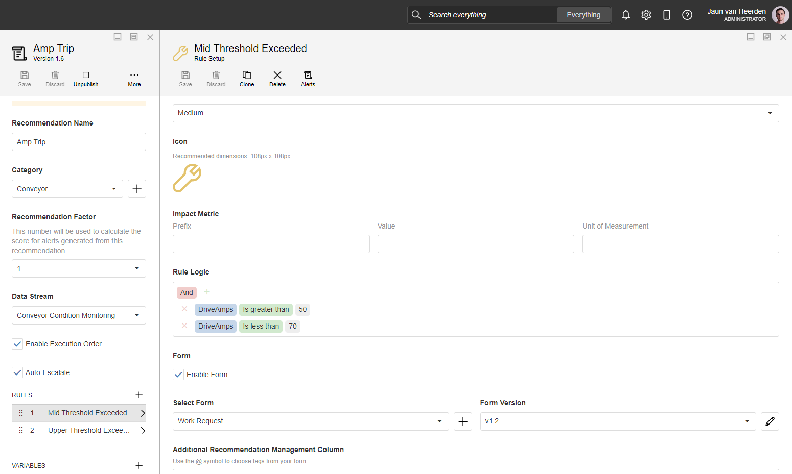
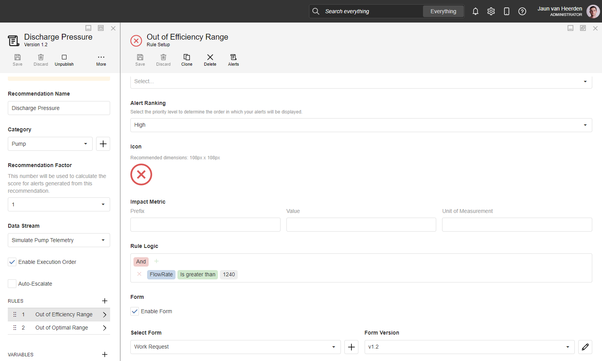
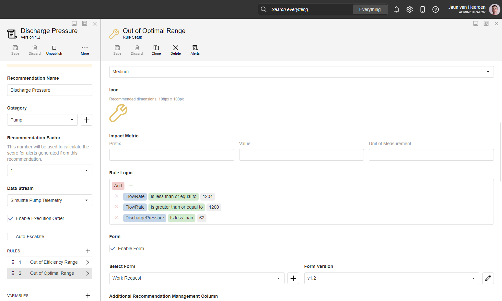

#  Smart Mining - Surface Processing Plant 

[◄ Accelerators](https://github.com/XMPro/Blueprints-Accelerators-Patterns/tree/master/Accelerators)

[◄ Blueprints, Accelerators & Patterns](https://github.com/XMPro/Blueprints-Accelerators-Patterns)

# Table of contents
1. [Files](#files)
2. [Description](#description)
3. [How To Import](#how-to-import)


# Files

<table>
<tr><td width="240px"> Type </td><td width="500px"> Name </td></tr>
<tr>
<td>SQL Scripts</td>
<td><a href="https://github.com/XMPro/Blueprints-Accelerators-Patterns/blob/master/Accelerators/Smart%20Mining%20-%20Surface%20Processing%20Plant/SQL%20Scripts/%5BDemoSTPPlantMapping%5D.sql" target="_blank">DemoSTPPIantMapping</a><br /><a href="https://github.com/XMPro/Blueprints-Accelerators-Patterns/blob/master/Accelerators/Smart%20Mining%20-%20Surface%20Processing%20Plant/SQL%20Scripts/%5BDemoWorkManagementPump%5D.sql" target="_blank">DemoWorkManagementPump</a></td>
</tr>
<tr>
<td>Data Stream</td>
<td><a href="https://github.com/XMPro/Blueprints-Accelerators-Patterns/blob/master/Accelerators/Smart%20Mining%20-%20Surface%20Processing%20Plant/Data%20Stream/Processing%20Plant%20Image%20Map%20View.xuc" target="_blank">Processing Plant Image Map View</a><br /><a href="https://github.com/XMPro/Blueprints-Accelerators-Patterns/blob/master/Accelerators/Smart%20Mining%20-%20Surface%20Processing%20Plant/Data%20Stream/Simulate%20Pump%20Telemetry.xuc" target="_blank">Simulate Pump Telemetry</a> <br /> <a href="https://github.com/XMPro/Blueprints-Accelerators-Patterns/blob/master/Accelerators/Smart%20Mining%20-%20Surface%20Processing%20Plant/Data%20Stream/Conveyor%20Condition%20Monitoring.xuc" target="_blank">Conveyor Condition Monitoring</a></td>
</tr>
<tr>
<td>Recommendation</td>
<td><a href="https://github.com/XMPro/Blueprints-Accelerators-Patterns/blob/master/Accelerators/Smart%20Mining%20-%20Surface%20Processing%20Plant/Recommendation/Amp%20Trip.xr" target="_blank"> Amp Trip</a><br /> <a href="https://github.com/XMPro/Blueprints-Accelerators-Patterns/blob/master/Accelerators/Smart%20Mining%20-%20Surface%20Processing%20Plant/Recommendation/Discharge%20Pressure.xr" target="_blank"> Discharge Pressure</a></td>
</tr>
<tr>
<td>Application</td>
<td><a href="https://github.com/XMPro/Blueprints-Accelerators-Patterns/blob/master/Accelerators/Smart%20Mining%20-%20Surface%20Processing%20Plant/Application/Surface%20Processing%20Plant.xapp" target="_blank">Surface Processing Plant</a></td>
</tr>
<tr>
<td>Template</td>
<td><a href="https://github.com/XMPro/Blueprints-Accelerators-Patterns-private/blob/master/Accelerators/Smart%20Mining%20-%20Surface%20Processing%20Plant/Template/Surface%20Processing%20Plant.xtml" target="_blank">Surface Processing Plant</a></td>
</tr>
</table>

# Description


## SQL Scripts


<details>
<summary>DemoSTPPIantMapping (Image mapping data for assets on schematic)</summary>

```SQL
SET ANSI_NULLS ON
GO
SET QUOTED_IDENTIFIER ON
GO
CREATE TABLE [dbo].[DemoSTPPlantMapping](
	[ID] [int] NOT NULL,
	[AssetNo] [nvarchar](6) NULL,
	[Description] [nvarchar](25) NULL,
	[Active] [bit] NULL,
	[X] [float] NOT NULL,
	[Y] [float] NOT NULL,
 CONSTRAINT [PK_DemoSTPPlantMapping] PRIMARY KEY CLUSTERED 
(
	[ID] ASC
)WITH (STATISTICS_NORECOMPUTE = OFF, IGNORE_DUP_KEY = OFF, OPTIMIZE_FOR_SEQUENTIAL_KEY = OFF) ON [PRIMARY]
) ON [PRIMARY]
GO
INSERT [dbo].[DemoSTPPlantMapping] ([ID], [AssetNo], [Description], [Active], [X], [Y]) VALUES (1, N'R-001', N'Reservoir-001', 1, 14, 50.25)
GO
INSERT [dbo].[DemoSTPPlantMapping] ([ID], [AssetNo], [Description], [Active], [X], [Y]) VALUES (2, N'R-002', N'Reservoir-002', 1, 63, 50.25)
GO
INSERT [dbo].[DemoSTPPlantMapping] ([ID], [AssetNo], [Description], [Active], [X], [Y]) VALUES (3, N'P-001', N'Pump-001', 1, 18.55, 63.55)
GO
INSERT [dbo].[DemoSTPPlantMapping] ([ID], [AssetNo], [Description], [Active], [X], [Y]) VALUES (4, N'P-002', N'Pump-002', 1, 35, 63.55)
GO
INSERT [dbo].[DemoSTPPlantMapping] ([ID], [AssetNo], [Description], [Active], [X], [Y]) VALUES (5, N'P-003', N'Pump-003', 1, 66, 63.55)
GO
INSERT [dbo].[DemoSTPPlantMapping] ([ID], [AssetNo], [Description], [Active], [X], [Y]) VALUES (7, N'C-001', N'Cyclone-001', 1, 48.28, 22.26)
GO
INSERT [dbo].[DemoSTPPlantMapping] ([ID], [AssetNo], [Description], [Active], [X], [Y]) VALUES (8, N'C-002', N'Cyclone-002', 1, 48.28, 54)
GO
INSERT [dbo].[DemoSTPPlantMapping] ([ID], [AssetNo], [Description], [Active], [X], [Y]) VALUES (9, N'P-509', N'Pump-509', 1, 39, 87.5)
GO
INSERT [dbo].[DemoSTPPlantMapping] ([ID], [AssetNo], [Description], [Active], [X], [Y]) VALUES (10, N'P-009', N'Pump-009', 1, 90.39, 77.02)
GO
INSERT [dbo].[DemoSTPPlantMapping] ([ID], [AssetNo], [Description], [Active], [X], [Y]) VALUES (11, N'P-78', N'Pump-778', 1, 39, 76)
GO
INSERT [dbo].[DemoSTPPlantMapping] ([ID], [AssetNo], [Description], [Active], [X], [Y]) VALUES (12, N'P-932', N'Pump-932', 0, 90.39, 86.02)
GO
INSERT [dbo].[DemoSTPPlantMapping] ([ID], [AssetNo], [Description], [Active], [X], [Y]) VALUES (13, N'T-001', N'Tank-001', 1, 16.5, 81.33)
GO
INSERT [dbo].[DemoSTPPlantMapping] ([ID], [AssetNo], [Description], [Active], [X], [Y]) VALUES (14, N'T-002', N'Tank-002', 1, 59, 81.33)
GO
INSERT [dbo].[DemoSTPPlantMapping] ([ID], [AssetNo], [Description], [Active], [X], [Y]) VALUES (15, N'M-001', N'Mill-001', 1, 35.5, 39.1)
GO
INSERT [dbo].[DemoSTPPlantMapping] ([ID], [AssetNo], [Description], [Active], [X], [Y]) VALUES (16, N'M-002', N'Mill-002', 1, 80, 39.1)
GO
INSERT [dbo].[DemoSTPPlantMapping] ([ID], [AssetNo], [Description], [Active], [X], [Y]) VALUES (17, N'B-001', N'Belt-001', 1, 12, 10.5)
GO
INSERT [dbo].[DemoSTPPlantMapping] ([ID], [AssetNo], [Description], [Active], [X], [Y]) VALUES (18, N'B-002', N'Belt-002', 1, 35, 10.4)
GO
INSERT [dbo].[DemoSTPPlantMapping] ([ID], [AssetNo], [Description], [Active], [X], [Y]) VALUES (19, N'B-003', N'Belt-003', 1, 12, 19.5)
GO
INSERT [dbo].[DemoSTPPlantMapping] ([ID], [AssetNo], [Description], [Active], [X], [Y]) VALUES (20, N'B-004', N'Belt-004', 1, 35, 19.5)
GO
INSERT [dbo].[DemoSTPPlantMapping] ([ID], [AssetNo], [Description], [Active], [X], [Y]) VALUES (21, N'B-005', N'Belt-005', 1, 12, 28.7)
GO
INSERT [dbo].[DemoSTPPlantMapping] ([ID], [AssetNo], [Description], [Active], [X], [Y]) VALUES (22, N'B-006', N'Belt-006', 1, 35, 28.7)
GO
INSERT [dbo].[DemoSTPPlantMapping] ([ID], [AssetNo], [Description], [Active], [X], [Y]) VALUES (23, N'P-004', N'Pump-004', 1, 82.55, 63.55)
GO
INSERT [dbo].[DemoSTPPlantMapping] ([ID], [AssetNo], [Description], [Active], [X], [Y]) VALUES (24, N'B-007', N'Belt-007', 1, -50, 50)
GO
INSERT [dbo].[DemoSTPPlantMapping] ([ID], [AssetNo], [Description], [Active], [X], [Y]) VALUES (25, N'B-008', N'Belt-008', 1, -50, 50)
GO
ALTER TABLE [dbo].[DemoSTPPlantMapping] ADD  CONSTRAINT [DF__ConveyorMotor__X__469D7149]  DEFAULT ((0)) FOR [X]
GO
ALTER TABLE [dbo].[DemoSTPPlantMapping] ADD  CONSTRAINT [DF__ConveyorMotor__Y__47919582]  DEFAULT ((0)) FOR [Y]
GO
```
</details>


<details>
<summary>DemoWorkManagementPump (Work order data for pump assets.)</summary>

```SQL
SET ANSI_NULLS ON
GO
SET QUOTED_IDENTIFIER ON
GO
CREATE TABLE [dbo].[DemoWorkManagementPump](
	[ID] [bigint] IDENTITY(1,1) NOT NULL,
	[AssetNo] [nvarchar](50) NULL,
	[WRNo] [nvarchar](50) NULL,
	[WONo] [nvarchar](50) NULL,
	[Title] [nvarchar](250) NULL,
	[WOStatus] [nvarchar](50) NULL,
	[Date] [datetime] NULL,
 CONSTRAINT [PK_DemoWorkManagementPump] PRIMARY KEY CLUSTERED 
(
	[ID] ASC
)WITH (STATISTICS_NORECOMPUTE = OFF, IGNORE_DUP_KEY = OFF, OPTIMIZE_FOR_SEQUENTIAL_KEY = OFF) ON [PRIMARY]
) ON [PRIMARY]
GO
SET IDENTITY_INSERT [dbo].[DemoWorkManagementPump] ON 
GO
INSERT [dbo].[DemoWorkManagementPump] ([ID], [AssetNo], [WRNo], [WONo], [Title], [WOStatus], [Date]) VALUES (1, N'P-778', N'3453788', N'114879', N'Grease drive end and opposite drive end motor bearings', N'INPROG', CAST(N'2021-03-24T00:00:00.000' AS DateTime))
GO
INSERT [dbo].[DemoWorkManagementPump] ([ID], [AssetNo], [WRNo], [WONo], [Title], [WOStatus], [Date]) VALUES (2, N'P-778', N'3446268', N'114900', N'Inspect mechanical seal for visible leakage', N'PLAN', CAST(N'2021-04-25T00:00:00.000' AS DateTime))
GO
INSERT [dbo].[DemoWorkManagementPump] ([ID], [AssetNo], [WRNo], [WONo], [Title], [WOStatus], [Date]) VALUES (3, N'P-778', N'3451228', N'114921', N'Take pump drive end and opposite drive end oil samples for oil analysis', N'PLAN', CAST(N'2021-04-25T00:00:00.000' AS DateTime))
GO
INSERT [dbo].[DemoWorkManagementPump] ([ID], [AssetNo], [WRNo], [WONo], [Title], [WOStatus], [Date]) VALUES (4, N'P-778', N'3446195', N'114942', N'Inspect motor and pump base plate bolts for looseness', N'PLAN', CAST(N'2021-04-25T00:00:00.000' AS DateTime))
GO
INSERT [dbo].[DemoWorkManagementPump] ([ID], [AssetNo], [WRNo], [WONo], [Title], [WOStatus], [Date]) VALUES (5, N'P-778', N'3446268', N'114963', N'Take manual vibration readings for the motor and pump drive end and opposite drive end bearings', N'SCHED', CAST(N'2021-04-05T00:00:00.000' AS DateTime))
GO
INSERT [dbo].[DemoWorkManagementPump] ([ID], [AssetNo], [WRNo], [WONo], [Title], [WOStatus], [Date]) VALUES (6, N'P-778', N'3446115', N'114984', N'Check shaft alignment', N'SCHED', CAST(N'2019-10-28T00:00:00.000' AS DateTime))
GO
INSERT [dbo].[DemoWorkManagementPump] ([ID], [AssetNo], [WRNo], [WONo], [Title], [WOStatus], [Date]) VALUES (7, N'P-778', N'3446139', N'115005', N'Inspect coupling for wear/damage', N'SCHED', CAST(N'2019-09-10T00:00:00.000' AS DateTime))
GO
INSERT [dbo].[DemoWorkManagementPump] ([ID], [AssetNo], [WRNo], [WONo], [Title], [WOStatus], [Date]) VALUES (8, N'P-778', N'3446163', N'115026', N'Inspect pump casing and gaskets for leakage', N'RESCHED', CAST(N'2019-10-10T00:00:00.000' AS DateTime))
GO
INSERT [dbo].[DemoWorkManagementPump] ([ID], [AssetNo], [WRNo], [WONo], [Title], [WOStatus], [Date]) VALUES (9, N'P-778', N'3446187', N'115047', N'Inspect drive end and opposite drive end bearings oil levels', N'COMPLETED', CAST(N'2019-09-28T00:00:00.000' AS DateTime))
GO
INSERT [dbo].[DemoWorkManagementPump] ([ID], [AssetNo], [WRNo], [WONo], [Title], [WOStatus], [Date]) VALUES (10, N'P-778', N'3446211', N'115068', N'Inspect coupling guard for damage/warpage', N'COMPLETED', CAST(N'2019-09-10T00:00:00.000' AS DateTime))
GO
SET IDENTITY_INSERT [dbo].[DemoWorkManagementPump] OFF
GO

```
</details>

##


## Data Stream


<a name="procplant"></a>
**Processing Plant Image Map View**

Passes data to image map in App Designer for the live status and location of each asset.

<details>
  <summary markdown="span">Expand to view screenshot</summary>


</details>

The data stream is configured using: 

* <a href="https://xmpro.gitbook.io/azure-sql/" target="_blank"><i>Azure SQL</i></a> <a href="https://documentation.xmpro.com/concepts/agent#listeners" target="_blank">context provider</a> - Allows you to read and output the entire contents of a table to the Data Stream for contextual data
  * use DemoSTPPlantMapping table
* <a href="https://xmpro.gitbook.io/read-recommendation/" target="_blank"><i>Read Recommendation</i></a> <a href="https://documentation.xmpro.com/concepts/agent#action-agents" target="_blank">action agent</a> - Read Recommendation
  * use Discharge Pressure recommendation
* <a href="https://xmpro.gitbook.io/join/" target="_blank"><i>Join</i></a> <a href="https://documentation.xmpro.com/concepts/agent#transformations" target="_blank">transformation</a> Joins streams
* <a href="https://xmpro.gitbook.io/calculated-field" target="_blank"><i>Calculated Field</i></a> <a href="https://documentation.xmpro.com/concepts/agent#transformations" target="_blank">transformation</a> Create new column values by applying expressions
* <a href="https://xmpro.gitbook.io/xmpro-app/" target="_blank"><i>XMPro App</i></a> <a href="https://documentation.xmpro.com/concepts/agent#action-agents" target="_blank">action agent</a> - Send data to App Designer


##

<a name="simpumptel"></a>

**Simulate Pump Telemetry**

An example of simulated pump telemetry data - broadcasting out via MQTT.

<details>
  <summary markdown="span">Expand to view screenshot</summary>


</details>

The data stream is configured using:

* <a href="https://xmpro.gitbook.io/event-simulator/" target="_blank"><i>Event Simulator</i></a> <a href="https://documentation.xmpro.com/concepts/agent#listeners" target="_blank">listener</a> - Simulates data for the stream
* <a href="https://xmpro.gitbook.io/calculated-field/" target="_blank"><i>Calculated Field</i></a> <a href="https://documentation.xmpro.com/concepts/agent#transformations" target="_blank">transformation</a> - Adding an Asset number
* <a href="https://xmpro.gitbook.io/broadcast/" target="_blank"><i>Broadcast</i></a> - Broadcast data to other agents
* <a href="https://xmpro.gitbook.io/rounding/" target="_blank"><i>Rounding</i></a> <a href="https://documentation.xmpro.com/concepts/agent#transformations" target="_blank">transformation</a> - Rounding all values
* <a href="https://xmpro.gitbook.io/xmpro-app/" target="_blank"><i>XMPro App</i></a> <a href="https://documentation.xmpro.com/concepts/agent#action-agents" target="_blank">action agents</a>
  * *Send Data to App Designer* is configured with a cache of 20 for the historic data
  * *Send Data to App Designer Single* is configured with a cache of 1 for live status
* <a href="https://xmpro.gitbook.io/mqtt/" target="_blank"><i>MQTT</i></a> <a href="https://documentation.xmpro.com/concepts/agent#action-agents" target="_blank">action agent</a> - Emit data via MQTT
* <a href="https://xmpro.gitbook.io/run-recommendation/" target="_blank"><i>Run Recommendation</i></a> <a href="https://documentation.xmpro.com/concepts/agent#recommendations" target="_blank">agent</a> - Run Recommendation rules


##

<a name="concondmon"></a>

**Conveyor Condition Monitoring**

A data stream to monitor the data for condition inferences of a conveyor.

<details>
  <summary markdown="span">Expand to view screenshot</summary>


</details>

The data stream is configured using: 

* <a href="https://xmpro.gitbook.io/event-simulator/" target="_blank"><i>Event Simulator</i></a> <a href="https://documentation.xmpro.com/concepts/agent#listeners" target="_blank">listener</a> - Simulates data for the stream
* <a href="https://xmpro.gitbook.io/azure-sql/" target="_blank"><i>Azure SQL</i></a> <a href="https://documentation.xmpro.com/concepts/agent#listeners" target="_blank">context provider</a> - provides contextual data of the conveyors
  * use DemoSTPPlantMapping table
* <a href="https://xmpro.gitbook.io/read-recommendation/" target="_blank"><i>Read Recommendation</i></a> <a href="https://documentation.xmpro.com/concepts/agent#action-agents" target="_blank">action agent</a> - Read Recommendation
* <a href="https://xmpro.gitbook.io/join/" target="_blank"><i>Join</i></a> <a href="https://documentation.xmpro.com/concepts/agent#transformations" target="_blank">transformation</a> - Join live data with context data
* <a href="https://xmpro.gitbook.io/calculated-field" target="_blank"><i>Calculated Field</i></a> <a href="https://documentation.xmpro.com/concepts/agent#transformations" target="_blank">transformations</a> 
  * Add column to join on
  * Clean up data for recommendation
* <a href="https://xmpro.gitbook.io/rounding/" target="_blank"><i>Rounding</i></a> <a href="https://documentation.xmpro.com/concepts/agent#transformations" target="_blank">transformation</a> - Rounding all values
* <a href="https://xmpro.gitbook.io/xmpro-app/" target="_blank"><i>XMPro App</i></a> <a href="https://documentation.xmpro.com/concepts/agent#action-agents" target="_blank">action agent</a> - Send data to App Designer


##


## Recommendation

<a name="amptrip"></a>
The recommendation is configured using two rules: 

<details>
<summary markdown="span">Amp Trip</summary>

+ Alerts if the amperage is outside the mid threshold



+ Alerts if the amperage is outside the upper threshold


</details>


<details>
<summary markdown="span">Discharge Pressure</summary>

+ Alerts if the discharge pressure is out of efficiency range
  


+ Alerts when the discharge pressure is out of optimal range
  


</details>


##

## Application
An Image map to show mapped recommendations, drill down enabled to illustrate a specific asset's details.


### Landing Page

<details>
	<summary markdown="span">Expand to view screenshot</summary>


</details>

The application page is configured using the following <a href="https://documentation.xmpro.com/concepts/application/block" target="_blank">blocks</a>:

* <a href="https://documentation.xmpro.com/blocks-toolbox/visualizations/image-map" target="_blank"><i>Image Map</i></a> to displaya schematic of the processing plant
* <a href="https://documentation.xmpro.com/blocks-toolbox/basic/text" target="_blank"><i>Text</i></a> to display the live data on a schematic
* <a href="https://documentation.xmpro.com/blocks-toolbox/visualizations/chart"><i>Charts</i></a> to visualize the count of open recommendations per priority level
* <a href="https://documentation.xmpro.com/blocks-toolbox/recommendations/recommendations" target="_blank"><i>Recommendations</i></a> to view current open recommendations for the asset


##

### Pump Drilldown Schematic

<details>
	<summary markdown="span">Expand to view screenshot</summary>


</details>

The application page is configured using the following <a href="https://documentation.xmpro.com/concepts/application/block" target="_blank">blocks</a>:

* <a href="https://documentation.xmpro.com/blocks-toolbox/visualizations/image-map" target="_blank"><i>Image Map</i></a> to display schematic of the pump
* <a href="https://documentation.xmpro.com/blocks-toolbox/basic/text" target="_blank"><i>Text</i></a> to display the live data on a schematic
* <a href="https://documentation.xmpro.com/blocks-toolbox/visualizations/circular-gauge"><i>Circular Gauge</i></a> showing efficiency and degredation loss
* <a href="https://documentation.xmpro.com/blocks-toolbox/visualizations/chart"><i>Charts</i></a> to visualize real time data
* <a href="https://documentation.xmpro.com/blocks-toolbox/basic/indicator" target="_blank"><i>Indicator</i></a> present operational safety risk
* <a href="https://documentation.xmpro.com/blocks-toolbox/recommendations/recommendations" target="_blank"><i>Recommendations</i></a> to view current open recommendations for the pump


##

### Pump Drilldown

<details>
	<summary markdown="span">Expand to view screenshot</summary>


</details>

The application page is configured using the following <a href="https://documentation.xmpro.com/concepts/application/block" target="_blank">blocks</a>:

* <a href="https://documentation.xmpro.com/blocks-toolbox/visualizations/unity-1" target="_blank"><i>Unity (Legacy)</i></a> to render a unity model of a pump
* <a href="https://documentation.xmpro.com/blocks-toolbox/visualizations/circular-gauge"><i>Circular Gauge</i></a> showing efficiency
* <a href="https://documentation.xmpro.com/blocks-toolbox/visualizations/circular-gauge"><i>Linear Gauge</i></a> showing health score
* <a href="https://documentation.xmpro.com/blocks-toolbox/visualizations/chart"><i>Charts</i></a> to visualize real time data
* <a href="https://documentation.xmpro.com/blocks-toolbox/basic/text" target="_blank"><i>Text</i></a> to display the live data
* <a href="https://documentation.xmpro.com/blocks-toolbox/basic/indicator" target="_blank"><i>Indicator</i></a> presenting the status of health rate
* <a href="https://documentation.xmpro.com/blocks-toolbox/recommendations/recommendations" target="_blank"><i>Recommendations</i></a> to view current open recommendations for the asset


##

### Pump Drilldown Timeseries View

<details>
	<summary markdown="span">Expand to view screenshot</summary>


</details>

The application page is configured using the following <a href="https://documentation.xmpro.com/concepts/application/block" target="_blank">blocks</a>:

* <a href="https://documentation.xmpro.com/blocks-toolbox/basic/text" target="_blank"><i>Text</i></a> to display the live data
* <a href="https://documentation.xmpro.com/blocks-toolbox/visualizations/chart"><i>Charts</i></a> to visualize the pump data for drilldown


##

### Pump Drilldown Timeseries Comparison

<details>
	<summary markdown="span">Expand to view screenshot</summary>


</details>

The application page is configured using the following <a href="https://documentation.xmpro.com/concepts/application/block" target="_blank">blocks</a>:

* <a href="https://documentation.xmpro.com/blocks-toolbox/basic/text" target="_blank"><i>Text</i></a> to display the live data
* <a href="https://documentation.xmpro.com/blocks-toolbox/visualizations/chart"><i>Charts</i></a> to visualize the data comparison
* <a href="https://documentation.xmpro.com/blocks-toolbox/basic/indicator" target="_blank"><i>Indicator</i></a> to indicate the flow rate levels


##

# How to Import
Import Password: 
```
Dem0nstr@t1on
```
For instructions on how to import <a href="https://documentation.xmpro.com/how-tos/import-export-and-clone#importing">click here</a>.

Create/confirm the following variables:
  * App Designer URL
  * App Designer Integration Key (Encrypted)
  * SQL Server
  * SQL Username
  * SQL Password (Encrypted)


## 1. Run SQL Scripts

	* Execute the scripts in SQL Server
  	* Ensure the data is successfully loaded into the database

## 2. Import the Data Stream

    * Select highest agent version number on import if prompted. 

    * Assign Access to others as required

	* Edit the XMPro agents and ensure the URL and Integration Key are selected
	* Edit the Recommendation agents and ensure the URL and Integration Key are selected

	* Click Apply and save the data stream (Click Save on the Action Bar, or CTRL + S on the keyboard)
	* Publish the data stream and open the live view
	* Ensure there is data in the live view at the Post telemetry agents

<details>
  <summary markdown="span">Expand to view screenshot of a successfully running data stream with live data</summary>

 
</details>

## 3. Import the Recommendations

    * Import the included forms if they don't already exist

<details>
  <summary markdown="span">Expand to view the Amp Trip Import</summary>

 

</details>


<details>
  <summary markdown="span">Expand to view Discharge Pressure Import</summary>

 

</details>

    * Assign Access to others as required

<details>
  <summary markdown="span">Expand to view screenshot</summary>

 

</details>

## 4. Import the Application

	* Map the data source on import:
  	* Landing Page: 
    	* Live Data: Processing Plant Image Map View | Publish to image map
  	* Pump Drilldown:
    	* LiveTelemetry: Simulate Pump Telemetry | Send to App Designer
  	* Pump Schematic:
    	* LiveTelemetry: Simulate Pump Telemetry | Send to App Designer
  
	* Confirm the connections are configured correctly in the App Data tab and in each Page Data tab.

  <details>
  <summary markdown="span">Expand to view screenshot</summary>

 
</details>

    * Assign Access to others as required for design and runtime
  <details>
  <summary markdown="span">Expand to view screenshot</summary>

 
</details>

    * Edit the Application

    * Select all recommendation elements
      * Block Properties > Behavior
        * Amp Trip
        * Discharge Pressure

    * Add credentials to connectors in App Data:
      * Azure Data Explorer (Pump Telemetry Data)
      * Azure Digital Twin (Azure Digital Twin) 
  
	* Save the Application
	* Publish the application
	* Ensure there is data in the application by checking each chart and data output block


## Contributing
This repository was created by <a href="https://xmpro.com/">XMPro</a>. For assistance or requests, please contact <a href="mailto:support@xmpro.com">support@xmpro.com</a>

## License
[](https://choosealicense.com/licenses/mit/)