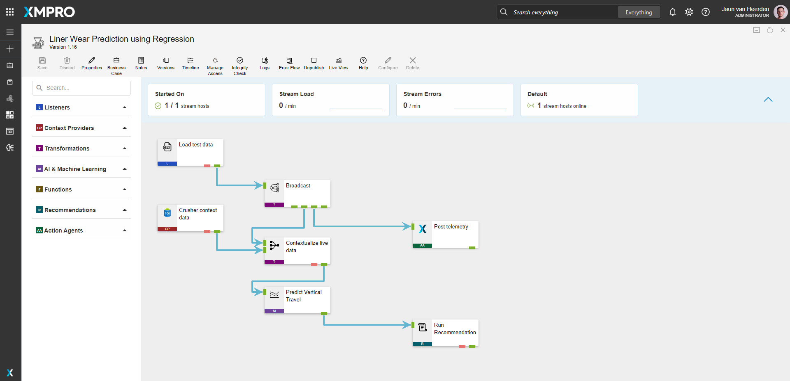
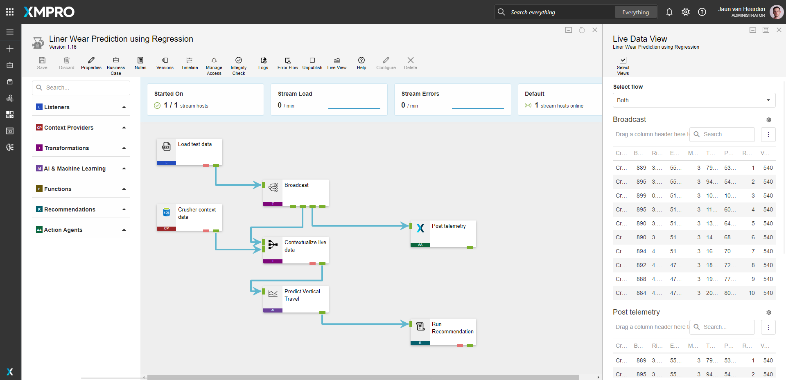

#  Liner Wear Protection - Regression 

[**◄ Patterns**](https://github.com/XMPro/Blueprints-Accelerators-Patterns/tree/master/Patterns)

[**◄ Blueprints, Accelerators & Patterns**](https://github.com/XMPro/Blueprints-Accelerators-Patterns)

# Files

* SQL Scripts: <a href="https://github.com/XMPro/Blueprints-Accelerators-Patterns/tree/master/Patterns/Machine%20Learning/Liner%20Wear%20Prediction%20-%20Regression/SQL%20Scripts" target="_blank">[DemoCrusher]</a>
* Data Stream: <a href="https://github.com/XMPro/Blueprints-Accelerators-Patterns/blob/master/Patterns/Machine%20Learning/Liner%20Wear%20Prediction%20-%20Regression/Liner%20Wear%20Prediction%20using%20Regression.xuc" target="_blank">Liner Wear Protection Regression</a>


# Description


## SQL Scripts


### DemoCrusher

Data for a crusher asset.

<details>
<summary>Columns</summary>

```
[ID]
,[AssetId]
,[Name]
,[Latitude]
,[Longitude]
,[Live]
,[HealthScore]
,[Location]
```
</details>


<!-- blank line -->
----
<!-- blank line -->


## Data Stream

Prediction of liner wear for a crusher asset.

The data stream is configured using: 

* <a href="https://xmpro.gitbook.io/csv/" target="_blank"><i>CSV</i></a> <a href="https://documentation.xmpro.com/concepts/agent#listeners" target="_blank">listener</a> - Simulate data from CSV file
* <a href="https://xmpro.gitbook.io/azure-sql/" target="_blank"><i>SQL</i></a> <a href="https://documentation.xmpro.com/concepts/agent#listeners" target="_blank">listener</a> - read consumer reference data from SQL
* <a href="https://xmpro.gitbook.io/broadcast/" target="_blank"><i>Broadcast</i></a> - Broadcast data to other agents
* <a href="https://xmpro.gitbook.io/xmpro-app/" target="_blank"><i>XMPro App</i></a> <a href="https://documentation.xmpro.com/concepts/agent#action-agents" target="_blank">action agent</a> - View data in the App Designer
* <a href="https://xmpro.gitbook.io/join/" target="_blank"><i>Join</i></a> <a href="https://documentation.xmpro.com/concepts/agent#transformations" target="_blank">transformation</a> - Contextualize data with data from SQL
* <a href="https://xmpro.gitbook.io/regression/" target="_blank"><i>Regression</i></a> <a href="https://documentation.xmpro.com/concepts/agent#ai-and-machine-learning" target="_blank">AI and machine learning agent</a> - Execute regression model on data
* <a href="https://xmpro.gitbook.io/run-recommendation/" target="_blank"><i>Run Recommendation</i></a> <a href="https://documentation.xmpro.com/concepts/agent#recommendation" target="_blank">agent</a> - Run Recommendation Rules


<details>
  <summary markdown="span">Expand to view screenshot</summary>


</details>

<!-- blank line -->
----
<!-- blank line -->


# How to Import
Import Password: `Dem0nstr@t1on`

Create/confirm the following variables
  * App Designer URL
  * App Designer Integration Key (Encrypted)
  * SQL Server
  * SQL Username
  * SQL Password (Encrypted)

For instructions on how to import <a href="https://documentation.xmpro.com/how-tos/import-export-and-clone#importing">click here</a>


## 1. Run SQL Scripts

	* Execute the scripts in SQL Server
	* Ensure the data is successfully loaded into the database


## 2. Import the Data Stream

    * Assign Access to others as required
	
	* Edit the XMPro agents and ensure the URL and Integration Key are selected
	* Edit the Recommendation agent and ensure the URL and Integration Key are selected
	* Edit the Azure SQL agent and ensure the Server Instance, Username and Password fields are filled in correctly

	* Click Apply and save the data stream (Click Save on the Action Bar, or CTRL + S on the keyboard)
	* Publish the data stream and open the live view
	* Ensure there is data in the live view at the Post telemetry agents

<details>
  <summary markdown="span">Expand to view screenshot of a successfully running data stream with live data</summary>

 
</details>


## Contributing
This repository was created by <a href="https://xmpro.com/">XMPro</a>. For assistance or requests, please contact <a href="mailto:support@xmpro.com">support@xmpro.com</a>

## License
[](https://choosealicense.com/licenses/mit/)