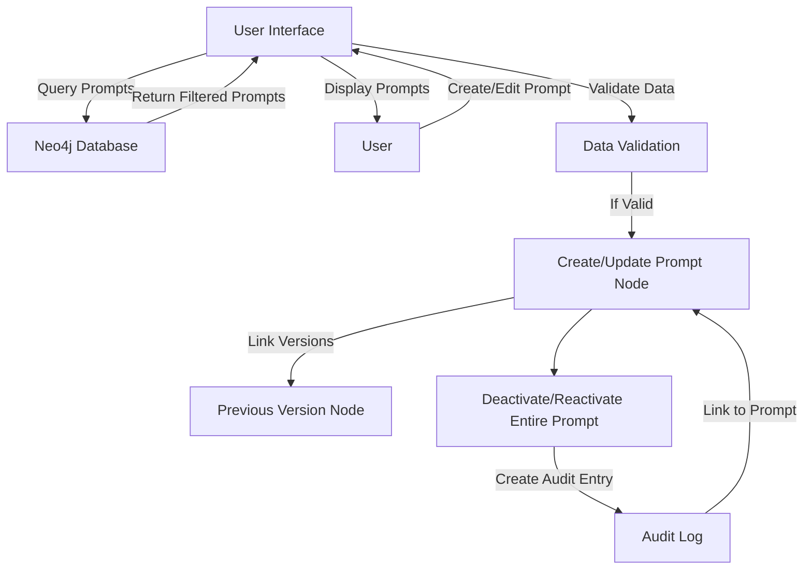

## Release Notes

### 1.1 
- Published from Beta

### Prior 1.1
- Beta Testing

## Overview
The Prompt Management Metablock provides a comprehensive system for creating, editing, and maintaining AI prompts within the XMPro Application Designer. This Metablock enables organizations to manage prompt libraries with version control, ensuring consistent AI interactions across applications. The Metablock supports internationalization, role-based access control, and maintains a complete audit trail of all prompt modifications.

The Metablock utilizes Neo4j for data persistence and implements efficient batch loading patterns to handle large prompt libraries. Its responsive interface adapts to different cultural preferences, including right-to-left languages, while providing consistent functionality across modern browsers and offering both light and dark themes.

## Dependencies
- Neo4j Browser Driver v5.17.0
- Modern browser with ES6+ support

## Installation and Setup
- Add a Metablock component to your page in the App Designer
- Open the Block Properties for the Metablock
- Upload the following files in the Block Properties:

| Section | File to Select |
|---------|---------------|
| HTML File | `main-admin-prompts.html` |
| CSS File | `main-admin-prompts.css` |
| JavaScript File | `main-admin-prompts.js` |

- Configure the Value Mappings:

| Key | Description | Values | Required |
|------|-------------|---------|-----------|
|`access_level`| User permission level | `system` \| `user` | Yes |
|`current_user`| Current user's email | XMPro variable `${user.email}` | Yes |
|`debug`| Enable debug logging | `true` \| `false` | No |
|`locale`| Interface language | `en-US`  | Yes |
|`neo4j_password`| Neo4j database password | String | Yes |
|`neo4j_uri`| Neo4j database connection URI | Valid Neo4j URI string | Yes |
|`neo4j_user`| Neo4j database username | String | Yes |
|`theme`| Interface color scheme | `light` (default) \| `dark` | No |

- Save and publish the page

## Key Features
- Comprehensive prompt CRUD operations
- Version control with activation management
- Audit history tracking
- Tag-based organization
- Role-based access control
- Internationalization support
- Dark/Light theme modes
- Real-time search and filtering
- Batch loading with infinite scroll
- Import/Export functionality

## Security Considerations

### Access Control
Four access levels with increasing privileges:
- User: Personal prompts only
- Restricted: Department-level access
- Admin: Organization-wide access
- System: Full system access

### Data Protection
- Secure Neo4j connections
- Role-based data access
- Audit trail for all changes
- Version control for recovery

## System Prompt Id Structure

Structure: `XMAGS-[Process]-PROMPT-[Version]`

Example: `XMAGS-OBS-PROMPT-001`

Components:
- XMAGS: Fixed identifier for the Multi-Agent System
- [Process]: The specific cognitive process (OBS, REF, PLAN, ACT)
- PROMPT: Fixed identifier for Prompt type
- [Version]: A numeric version identifier

### Examples

| Prompt Purpose     | Prompt ID             | Breakdown                                                                     |
|--------------------|------------------------|-------------------------------------------------------------------------------|
| Action Prompt      | XMAGS-ACT-PROMPT-001  | XMAGS: Multi-Agent System<br>ACT: Action<br>PROMPT: Type<br>001: Version      |
| Observation Prompt | XMAGS-OBS-PROMPT-001  | XMAGS: Multi-Agent System<br>OBS: Observation<br>PROMPT: Type<br>001: Version |
| Planning Prompt    | XMAGS-PLAN-PROMPT-001 | XMAGS: Multi-Agent System<br>PLAN: Planning<br>PROMPT: Type<br>001: Version   |
| Reflection Prompt  | XMAGS-REF-PROMPT-001  | XMAGS: Multi-Agent System<br>REF: Reflection<br>PROMPT: Type<br>001: Version  |

### Fields

| Field Name         | Type             | Description                                        | Expanded Rationale                                                                                                                                                                                                                                    |
|--------------------|------------------|----------------------------------------------------|-------------------------------------------------------------------------------------------------------------------------------------------------------------------------------------------------------------------------------------------------------|
| access_level       | String           | Indicates who can use or modify this prompt        | Useful for implementing access control. In a multi-user or organization setting, this allows for restricting sensitive prompts to certain user groups or individuals, enhancing security and privacy.                                                 |
| active             | Boolean          | Indicates if the prompt is currently in use        | Allows for easy filtering of current vs. archived prompts. This is particularly useful in large systems where prompts may be deprecated but kept for historical reasons. It simplifies queries for active prompts.                                    |
| author             | String           | The creator of the prompt                          | Important for attribution and accountability. In a multi-user system, this allows tracking who created which prompts, which can be useful for quality control, performance evaluation, and giving credit where it's due.                              |
| category           | String           | The general category or type of the prompt         | Allows for easier organization and retrieval of prompts. This can be used to group similar prompts together, making it easier for users to find relevant prompts for their needs. It also allows for analysis of prompt performance by category.      |
| created_date       | DateTime         | Date and time the prompt was created               | Useful for tracking the prompt's lifecycle. This timestamp helps in auditing, allows for chronological sorting of prompts, and can be used to analyze prompt creation patterns over time.                                                             |
| description        | String           | A brief explanation of the prompt's purpose        | Provides context without having to read the full prompt. This helps users quickly understand what a prompt does without needing to interpret the prompt text itself. It's particularly useful in large prompt libraries.                              |
| internal_name      | String           | A code-friendly name for backend use               | This internal name is used code, queries, and other backend operations where a simplified, consistent naming format is beneficial.                                                                                                                    |
| last_modified_date | DateTime         | Date and time of the last modification             | Important for tracking changes and auditing. This helps identify which prompts have been recently updated, which is crucial for version control and ensuring users are working with the most up-to-date prompts.                                      |
| last_used_date     | DateTime         | Date the prompt was last utilized                  | Useful for identifying outdated or frequently used prompts. This can help in maintenance tasks, such as archiving old prompts or prioritizing the review of frequently used ones. It can also be used to analyze usage patterns over time.            |
| max_tokens         | Integer          | Maximum number of tokens allowed for this prompt   | Defines the upper limit of tokens for the prompt response. This is crucial for controlling the length and complexity of AI-generated content, managing computational resources, and ensuring responses fit within model constraints.                |
| model_name         | String           | The specific AI model this prompt is optimized for | Provides more granular information about model compatibility. This allows for fine-tuned optimization of prompts for specific models, which can be crucial for achieving the best performance.                                                        |
| model_provider         | String           | The provider of the AI model this prompt is designed for   | Ensures prompts are used with compatible model architectures. This is crucial for maintaining prompt effectiveness across different AI systems. It allows for easy filtering of prompts suitable for specific model types.                            |
| name               | String           | A unique, human-readable name for the prompt       | Provides a quick, identifiable reference for the prompt. This makes it easier for users to search for and recognize prompts without needing to read the full prompt text. It also serves as a natural key for ensuring uniqueness across all prompts. |
| prompt             | String           | The actual prompt text                             | Core content of the prompt. This is the main text that will be used to guide the AI's response. It's crucial for the functioning of the system and is what users will primarily interact with.                                                        |
| prompt_id          | String           | Unique identifier for the prompt                   | Essential for referencing specific prompts. This allows for efficient querying and relationship building in the graph database. It's particularly useful when linking prompts to other entities or when tracking prompt versions.                     |
| reserved_fields    | Object/String    | Any reserved fields                                | Useful for storing prompt-specific metadata that doesn't fit into other categories. This flexibility allows for future expansions without changing the node structure. It can store custom attributes that are specific to certain types of prompts.  |
| type               | String           | The type of prompt (e.g., "system", "user")        | Categorizes the prompt's role in the system. This classification is essential for organizing prompts, applying appropriate access controls, and determining how the prompt should be processed or utilized within the AI system's workflows.       |
| tags               | Array of Strings | Relevant tags or keywords                          | Enhances searchability and categorization. Tags provide a flexible way to associate prompts with multiple concepts, making them easier to find. They can also be used for filtering and analyzing trends in prompt creation and usage.                |
| version            | Integer          | Current version number of the prompt               | Helps in tracking the evolution of the prompt. This is crucial for version control, allowing users to understand how many iterations a prompt has gone through and potentially rollback to previous versions if needed. 

## Prompt Management Guide

### User Interface

The UI is divided into three main sections:
1. **Prompt List**: Displays all prompts, organized by categories.
2. **Prompt Editor**: Form for creating or editing prompts.
3. **Metadata Panel**: The metadata for the prompt selected.

### Creating a New Prompt
1. Click the "New Prompt" button in the top-left corner
2. Enter the Area and Function codes (e.g., WTR for Water, QUAL for Quality)
3. Click "Generate" to create a unique Prompt ID
4. Complete the required fields:
   - Name: Descriptive name for the prompt
   - Internal Name: System identifier (must be unique)
   - Description: Detailed explanation of prompt's purpose
   - Model Provider: Select from available AI providers
   - Model Name: Specify the model
   - Max Tokens: Set maximum token limit
5. Enter the prompt content in the main text area
6. Add relevant tags to categorize the prompt
7. Click the floating save button to create the prompt

### Editing Existing Prompts
1. Select the prompt from the list on the left
2. Review and modify desired fields in the prompt editor:
5. Click the floating save button to create a new version
4. Verify successful update in the version history

### Clone Prompt 
1. Select an existing prompt from the list
2. Click the "Clone Prompt" button 
3. Review and modify the cloned prompt as needed
4. Click the floating save button to create and save the cloned prompt

### Managing Prompt Versions
1. Select the prompt to manage
2. Access version controls in the metadata panel:
   - Use version dropdown to view available versions
   - Select specific version to review content
   - Click activate button (checkmark) to set active version
3. Review version history:
   - Click three-dot menu on prompt
   - Select "View History"
   - Review audit trail in modal window
4. Monitor active version status in prompt list

### Importing Prompts
1. Click the import icon (upload arrow) in the toolbar
2. Select a JSON file containing prompt data
3. Review and modify the imported prompt as needed
4. Click the floating save button to create and save the imported prompt

### Exporting Prompts
1. Select the prompt to export
2. Click the export icon (download arrow)
3. Choose save location in file browser

### Search and Filtering
1. Use the search bar for real-time search:
   - Enter prompt name or ID
   - Type keywords for content search
   - Search by tag or category
2. Apply filters as needed:
   - Toggle status filters for active/inactive prompts
   - Select category filters
   - Combine multiple filters for refined results
3. Clear filters:
   - Click clear button (x) in search bar
   - Deselect active filters
   - Reset to view all prompts

### Audit History
- The system maintains an audit log when an entire prompt is made inactive or reactivated.
- Users can view the audit history for each prompt.

#### Audit Entry Properties

Each AuditEntry node contains the following information:

- `change`: Description of the action or change made (e.g., "Deactivated prompt")
- `user`: The user who performed the action
- `timestamp`: The date and time when the action occurred

#### Example Audit Log Entries

Here are some example audit log entries from the system:

1. Deactivation of a prompt:
   - Change: "Deactivated prompt"
   - User: "Sam Johnson"
   - Timestamp: 2024-09-01 15:04:35.284

2. Earlier deactivation of the same prompt:
   - Change: "Deactivated prompt"
   - User: "Sam Johnson"
   - Timestamp: 2024-09-01 15:02:30.304

3. Initial deactivation of the prompt:
   - Change: "Deactivated prompt"
   - User: "Sam Johnson"
   - Timestamp: 2024-09-01 15:01:21.827

## Import/Export Format Examples

The following examples demonstrate the JSON structure required for importing prompts. Each example showcases different types of prompts with their specific configurations.

Basic Analysis Prompt:
```json
{
  "prompt_id": "WTR-QUAL-PROMPT-001",
  "name": "Water Quality Analysis",
  "internal_name": "water_quality_analysis_base",
  "description": "Analyzes water quality parameters and provides detailed recommendations based on standardized water quality metrics. Suitable for both drinking water and environmental water quality assessment.",
  "model_provider": "Anthropic",
  "model_name": "claude-3-opus-20240229",
  "max_tokens": 4096,
  "prompt": "You are a water quality expert analyzing test results. Given the following water quality parameters {parameters}, analyze each parameter against standard safety thresholds. For any parameters outside acceptable ranges, explain the potential implications and provide specific recommendations for remediation. Structure your response with:\n\n1. Overall Water Quality Assessment\n2. Detailed Parameter Analysis\n3. Health and Environmental Implications\n4. Recommended Actions\n\nInclude relevant regulatory standards in your analysis where applicable.",
  "category": "Environmental",
  "type": "analysis",
  "access_level": "user",
  "tags": ["water quality", "analysis", "recommendations", "environmental"],
  "active": true,
  "version": "1",
  "author": "system.admin@organization.com"
}
```

System Configuration Prompt:
```json
{
  "prompt_id": "SYS-CONF-PROMPT-001",
  "name": "System Configuration Assistant",
  "internal_name": "system_config_assistant",
  "description": "Provides guidance for system configuration tasks with a focus on security best practices and performance optimization.",
  "model_provider": "Anthropic",
  "model_name": "claude-3-opus-20240229",
  "max_tokens": 2048,
  "prompt": "As a system configuration expert, assist with the following configuration task for {system_name}. Consider these key factors:\n\n- Current Configuration: {current_config}\n- Security Requirements: {security_reqs}\n- Performance Targets: {performance_targets}\n\nProvide specific configuration recommendations that:\n1. Meet all security requirements\n2. Optimize system performance\n3. Follow industry best practices\n\nInclude both configuration values and explanations for each recommendation.",
  "category": "System",
  "type": "configuration",
  "access_level": "admin",
  "tags": ["system", "configuration", "security", "performance"],
  "active": true,
  "version": "1",
  "author": "system.admin@organization.com"
}
```

Data Transformation Prompt:
```json
{
  "prompt_id": "DAT-TRAN-PROMPT-001",
  "name": "Data Format Transformer",
  "internal_name": "data_transformer_base",
  "description": "Transforms data between different formats while preserving data integrity and maintaining proper structure.",
  "model_provider": "Anthropic",
  "model_name": "claude-3-opus-20240229",
  "max_tokens": 3072,
  "prompt": "Transform the provided {source_format} data into {target_format} format. Apply the following rules:\n\n1. Maintain data integrity for all fields\n2. Follow the schema: {schema_definition}\n3. Apply data type validations: {validation_rules}\n\nInput Data:\n{input_data}\n\nProvide the transformed data along with a verification summary including any warnings or potential data quality issues.",
  "category": "Data Processing",
  "type": "transformation",
  "access_level": "restricted",
  "tags": ["data", "transformation", "validation"],
  "active": true,
  "version": "1",
  "author": "data.engineer@organization.com"
}
```

## Data Flow


## Prompt Management Taxonomies

### Access Levels

| Level      | Description                                                                                   |
| ---------- | --------------------------------------------------------------------------------------------- |
| admin      | For system administrators with full access to all prompts                                      |
| restricted | For sensitive prompts that require special permission to access                                |
| system     | For core system prompts essential for the functioning of the MAGs memory cycle implementation  |
| user       | For regular users of the system                                                                |

The Prompt Library implements a role-based access control system with four levels: system, admin, restricted, and user. Each level has different permissions and capabilities within the system.

#### Access Level Permissions Table

| Feature                     | System | Admin | Restricted | User |
|-----------------------------|--------|-------|------------|------|
| View all prompts            | ✓      | ✓     | ✗          | ✗    |
| Create new prompts          | ✓      | ✓     | ✓          | ✓    |
| Edit own prompts            | ✓      | ✓     | ✓          | ✓    |
| Edit others' prompts        | ✗      | ✓     | ✗          | ✗    |
| Delete prompts              | ✗      | ✗     | ✗          | ✗    |
| Activate/Deactivate prompts | ✓      | ✓     | ✓          | ✓    |
| View audit history          | ✓      | ✓     | ✓          | ✓    |
| Import/Export prompts       | ✓      | ✓     | ✓          | ✓    |
| Clone prompts               | ✓      | ✓     | ✓          | ✓    |
| Manage system prompts       | ✓      | ✗     | ✗          | ✗    |
| Change prompt access level  | ✓      | ✓     | ✗          | ✗    |
| View restricted prompts     | ✗      | ✓     | ✓          | ✗    |

### Category Types

| Type                 | Description                                   |
| -------------------- | --------------------------------------------- |
| conversation         | For the conversation functionality            |
| memory_cycle         | For core memory_cycle functionality           |
| plan_solve_strategy  | For the plan and solve strategy functionality |
| team_creation_wizard | For the team wizard functionality             |
| user_defined         | Defaults to for storing user prompts                      |

### Prompt Types

| Type           | Description                                                                     |
| -------------- | ------------------------------------------------------------------------------- |
| analysis       | For prompts designed to analyze or interpret data or text                        |
| classification | For prompts that categorize or label input                                       |
| dialogue       | For prompts used in conversational or interactive contexts                       |
| extraction     | For prompts designed to extract specific information from text                   |
| generation     | For prompts focused on generating new content or ideas                           |
| system         | For core system functionality                                                    |
| task-specific  | For prompts designed for particular tasks within the application                 |
| template       | For base prompts that can be customized or extended for specific use cases       |
| user           | For prompts created or customized by users                                       |
| utility        | For helper prompts that support other processes but aren't main functionalities  |

## Root Node
There is a root node called Library (type: `prompt`) to which all prompts are linked.  The reasons for this are:

1. Organization: It provides a clear organizational structure, making it easier to manage and understand the relationship between prompts.

2. Querying: While it adds one more hop in some queries, it makes it much easier to perform operations on all prompts (e.g., finding all prompts, updating properties across all prompts).

3. Consistency: Having a root node allows you to enforce consistent properties or relationships across all prompts more easily.

4. Scalability: As your prompt library grows, having a root node will make it easier to manage and maintain the structure.

5. Flexibility: You can still easily query individual prompts, and the added structure doesn't significantly impact performance for most use cases.

## Querying Examples

These example Cyphers can be run on the graph database to return the specific details:

- Latest Versions Only:

```Cypher
   MATCH (p:Prompt)
   WHERE p.active = true
   RETURN p
   ORDER BY p.prompt_id
```

-  Full Version of history:

```Cypher
MATCH path = (p:Prompt {internal_name: "planning_decision_prompt"})<-[:PREVIOUS_VERSION*]-(older:Prompt)
RETURN path```

Replace `internal_name` with the prompt in question to query.